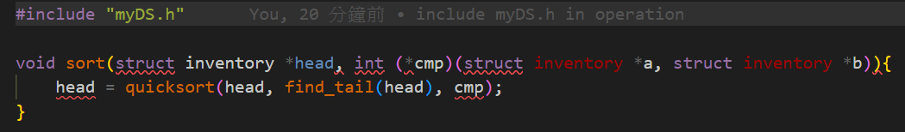
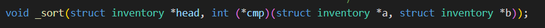

title: 'C Error: 不允許回傳函式的函式'
author: int
tags:
  - c
  - c error
categories: []
date: 2022-05-30 11:16:00
---
昨天在寫C語言期末專案的時候遇到了這個錯誤，簡單來說因為C語言沒辦法像javascript或其他語言那樣在函式裡回傳函式(無法寫巢狀函式)才會產生這個錯誤，但問題是我宣告的函式根本沒有回傳函式阿! 那怎麼會這樣? 先來看看我宣告了什麼函式。

這裡我是想寫一個自己的qsort，並用自訂的struct與linked-list實作，你們有發現什麼問題嗎? 沒錯就是這個函式的名稱，原來sort是c的保留字阿，我完全忘記c已經有sort()這個函式，應該說我以前沒有用到就一直以為只有qsort()，所以我只需要把sort名字改掉就行了，這邊我改成_sort()就沒報錯了。

又學到了一課，不過這次好像是我自己蠢，下次記得sort()不能拿來當自訂函式名稱。