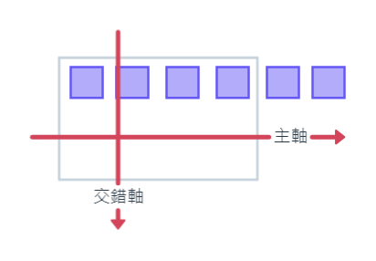

title: 'CSS排版: FLEX(1)'
author: int
tags:
  - css
  - css-flex
categories:
  - css flex
date: 2022-05-24 13:42:00
---
## 前言
### 此文章為觀看[六角學院CSS Flex 超詳解，彈性版型任你操控！](https://youtu.be/88ymaHaStoQ)影片後整理之筆記

整理下來有點太多，可能會分成兩篇來記錄，想看下一篇可以到[這裡](https://huanginch.github.io/2022/05/25/CSS-Flex-2/)

## FLex介紹

Flex是一個CSS中很常使用的排版工具，他能夠自由操作div容器，主要概念為下圖

可以透過操作主軸與交錯軸來達成排版，預設主軸線為由左至右，交錯軸為由上至下

### 語法介紹
#### 外容器:
1. display: flex;(**需加在外容器上**)
2. flex-flow:
    * flex-direction-控制主軸方向:
        * row (預設值，由左至右)
        * row-reverse(由右至左)
        * column(由上至下)
        * column-reverse(由下至上)
    * flex-wrap-換行方式:
        * nowrap(不使用)
        * wrap(遇到邊界自動換行)
3. justify-content-對齊主軸線方式:
	* center(置中)
    * flex-start(靠主軸起點)
    * flex-end(靠主軸終點)
    * space-between(中間留空格)
    * space-around(元素左右都留空格，但比例為1:2:1)
    * space-evenly(元素左右平均分配空格)
4. align-items-與交錯軸對齊方式:
    * center(置中)
    * flex-start(靠交錯軸起點)
    * flex-end(靠交錯軸終點)
    * strech(預設值，撐開至flexbox大小)
    * baseline(對齊內容物基線)
5. align-content-內容物對齊方式
	* center(每行對齊交錯軸線中間)
    * flex-start(每行貼齊交錯軸線最前端)
    * flex-end(每行貼齊交錯軸線最末端)
    * space-between(第一行與最後一行分別對齊交錯軸線最前端與最末端)
    * space-around(每行平均分配每行間距)
    * strech(預設值，每行內容元素全部撐開至 flexbox 大小)
    
#### 內容器:
1. flex:
	* flex-grow(子元素伸展比例分配)
    * flex-shrink(子元素壓縮比例分配)
    * flex-basis(子元素基本大小)
2. order: 老師這裡沒有特別介紹，以後學會再補上
3. align-self:
	* center(置中)
    * flex-start(靠交錯軸起點)
    * flex-end(靠交錯軸終點)
    * strech(撐開至flexbox大小)
4. margin-子元素邊界
    
下一篇將會以程式碼做與實例做更進一步的講解。