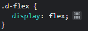
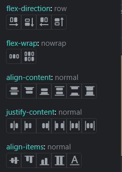
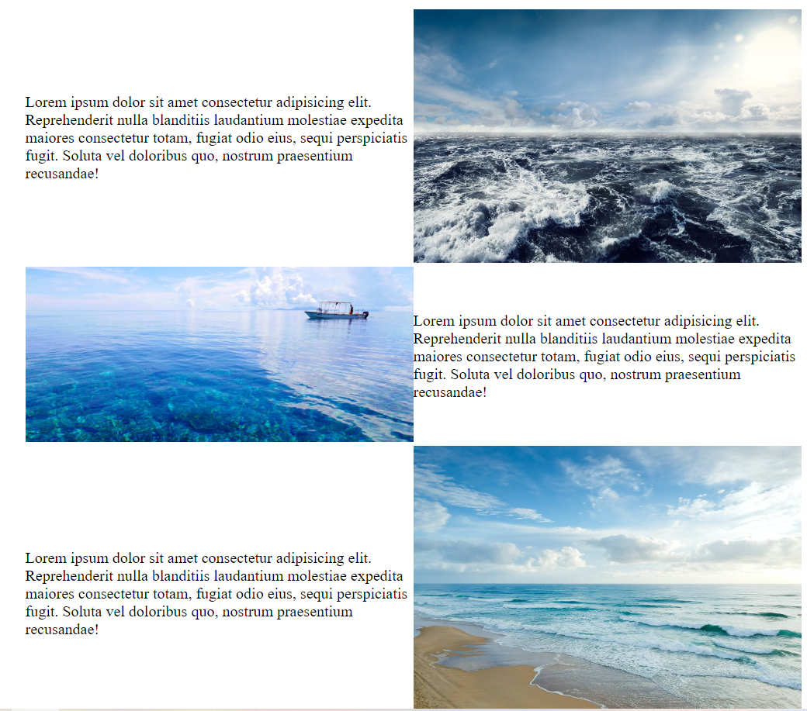

title: 'CSS排版: Flex(2)'
author: int
tags:
  - css
  - css-flex
categories:
  - css flex
date: 2022-05-25 11:16:00
---
此文章為觀看[六角學院CSS Flex 超詳解，彈性版型任你操控！](https://youtu.be/88ymaHaStoQ)影片後整理之筆記。<br/>
[上一篇](https://huanginch.github.io/2022/05/24/CSS-FLEX-1/)介紹了外容器和內容器的語法，這篇會來示範一些例子。

## Chrome 開發者工具

在介紹例子之前，先來介紹chrome內建的好用工具，假如你在你的專案上用到了flex語法，可以f12打開開發者工具，在style的地方找到你撰寫display:flex的地方，你會發現有個圖案(如圖1)，按下去之後你會看到許多在上一篇出現的語法(如圖2)，點擊這些按鈕你可以即時預覽各種語法在你的網頁上呈現的效果。




## flex實例
### 圖片文字交錯


* 這題的重點在於要善用內容器語法，先把所有內容器設成一致(文字左，圖片右)，一來方便管理，二來在做RWD時會方便許多。
* 程式碼如下
<iframe height="300" style="width: 100%;" scrolling="no" title="Untitled" src="https://codepen.io/intHuang/embed/ExQbYrQ?default-tab=html%2Cresult" frameborder="no" loading="lazy" allowtransparency="true" allowfullscreen="true">
  See the Pen <a href="https://codepen.io/intHuang/pen/ExQbYrQ">
  Untitled</a> by int (<a href="https://codepen.io/intHuang">@intHuang</a>)
  on <a href="https://codepen.io">CodePen</a>.
</iframe>

* 仔細看第二個元素，我使用了```flex-direction: row-reverse;```

### 相簿式排版


* 這題相對簡單，簡單來說把大張圖片和三張小張圖片切割成兩個容器，小張圖片再使用flex-direction改成垂直方向。

<iframe height="300" style="width: 100%;" scrolling="no" title="相簿式排版-使用flex" src="https://codepen.io/intHuang/embed/NWywKVN?default-tab=html%2Cresult" frameborder="no" loading="lazy" allowtransparency="true" allowfullscreen="true">
  See the Pen <a href="https://codepen.io/intHuang/pen/NWywKVN">
  相簿式排版-使用flex</a> by int (<a href="https://codepen.io/intHuang">@intHuang</a>)
  on <a href="https://codepen.io">CodePen</a>.
</iframe>

* 要注意一點，為了避免圖片因排版而被擠壓變形，這裡使用了```object-fit:cover;```

## 總結
影片內容差不多就這些，老師講的很淺顯易懂，算是對我幫助很大，如果有哪裡不懂也推薦大家去看老師影片。