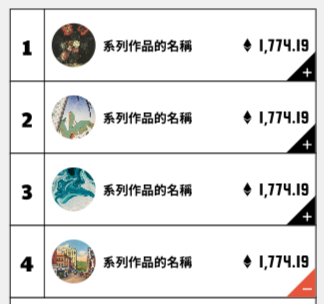
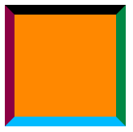
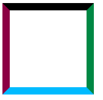

title: 'CSS: 製作三角形'
author: int
tags:
  - css
categories: []
date: 2022-09-05 22:22:00
---
你知道CSS不只可以用來幫網頁增加樣式，還可以在網頁上畫圖嗎?在卡片右下方放上一個三角形算是蠻常見的設計(如圖)，所以這篇會來介紹如何畫出三角形，為你的網頁增加設計感。

## 步驟

1. 首先給一個box

	
    
2. 給他的四邊加上不同顏色的border觀察一下，可以發現border和border之間的邊緣是斜的，我們就是要利用這個特性製作三角形

3. 把背景改成透明只留下border

4. 讓box的長寬都歸零，這時候三角形就出現了

5. 把自己想要的三角形留下，其他border改成透明(這裡我留右邊和下面，並都改成藍色)

## Codepen

<iframe height="300" style="width: 100%;" scrolling="no" title="Untitled" src="https://codepen.io/intHuang/embed/rNvaoxV?default-tab=html%2Cresult" frameborder="no" loading="lazy" allowtransparency="true" allowfullscreen="true">
  See the Pen <a href="https://codepen.io/intHuang/pen/rNvaoxV">
  Untitled</a> by int (<a href="https://codepen.io/intHuang">@intHuang</a>)
  on <a href="https://codepen.io">CodePen</a>.
</iframe>

## 總結

是不是很神奇? 自己在寫得時候可以跳過1、2步驟，直接寫transparent就好，這邊只是方便講解才列出的。