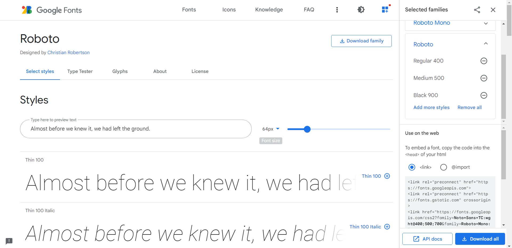
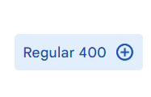
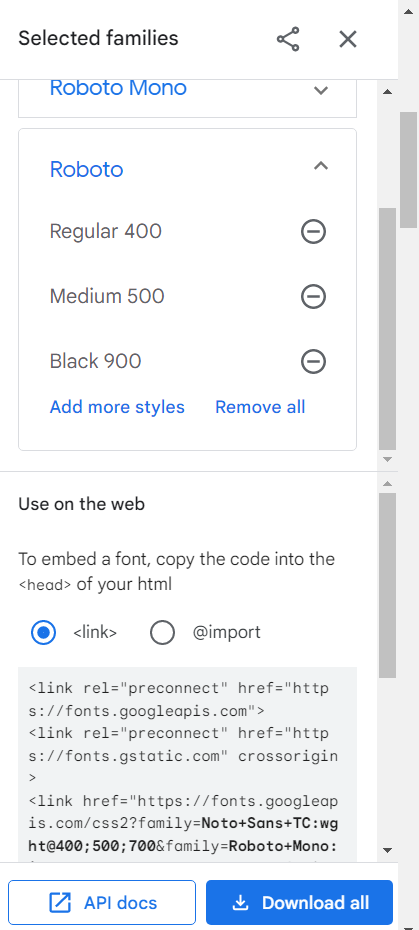
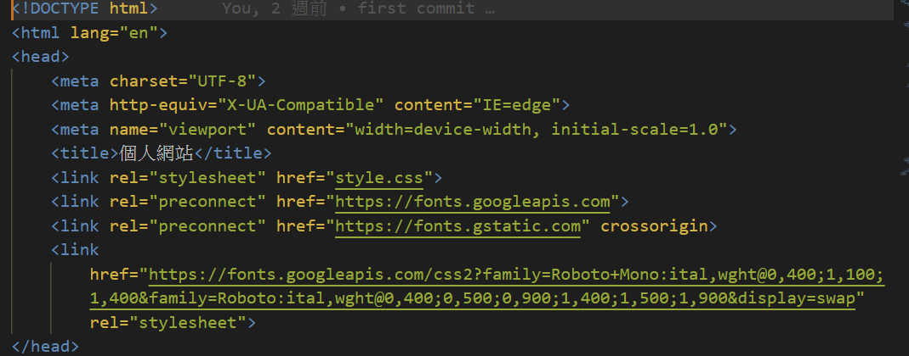
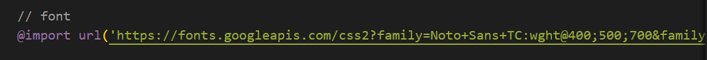

title: Google Font 載入方法
author: int
tags:
  - css
categories: []
date: 2022-08-04 22:42:00
---
Google提供了許多開源的線上字型，這篇會來介紹如何在自己的專案載入Google提供的字型。

1. 首先到 [Google Font](https://fonts.google.com/about)的網站點選Font

	

2. 選一個你想要的字型，也可以用搜尋的

	

3. 我這邊示範選擇Roboto，點進去之後會看到下面的畫面

	
    
4. 對自己想要的字重按+號，想按引入幾種就按幾種。

	
    
5. 右手邊就會出現你選擇的字型

	
    
6. 點選link可以貼到html的header上

	

7. 又或者是點選import可以從scss上載入

	
    
8. 這樣就載入完成了，可以使用font-family語法直接引入字型了

```css
.body {
	font-family: Roboto;
}
```
