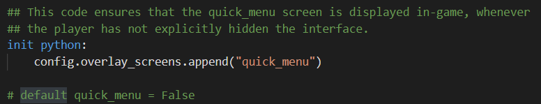

title: 'Ren''Py : How to hide quick menu on screen'
author: int
tags:
  - Ren'Py
categories: []
date: 2022-05-26 13:32:00
---
最近在做的Ren'py side project我想要實作一個功能，就是常見的齒輪菜單，我希望按下畫面上的齒輪就能顯示與隱藏菜單(如圖，並且這裡的菜單都是指遊戲內的quick menu)，找了很多文章提供的方法都不符合我想呈現的效果，所以這篇文就是來介紹如何實作這樣的一個功能。

## 隱藏quick menu
首先要讓quick menu有辦法在畫面上被隱藏，原本screen.py裡用的是if quick_menu，但因為齒輪的部分使用了imagebutton，imagebutton裡並沒有比較簡單自訂action的方法，所以我們這裡要把if quick menu這個statement刪掉。

下面宣告quick menu變數部分也可以順便註解掉。

你會發現quick menu依舊還是在畫面上，那是因為這一行程式碼的關係，他會讓quick menu永遠顯示在畫面上，註解掉後就可以對quick menu進行操作了。

## 增加imagebutton
再來就是新增一個screen，並放入一個[imagebutton](https://www.renpy.org/doc/html/screens.html?#imagebutton)，這邊你可以依照自己需求調整位置與圖片之類的。

## 使用ToggleScreen()
最後，這裡利用了[ToggleScreen()](https://www.renpy.org/doc/html/screen_actions.html?#ToggleScreen)函式來顯示或隱藏quick menu。

之後為了讓齒輪一直保持在畫面上利用了剛剛註解掉的程式碼，把quick_menu改成我自訂的screen。

這樣簡單的自訂quick menu就完成了。

## 結語
一開始使不管怎麼用toggleScreen他都不會隱藏，後來才發現原來是init那行在搞鬼，分享出來希望能幫助到跟我有一樣問題的人，以後可能也會有幾篇Ren'Py的文章，希望大家會喜歡。