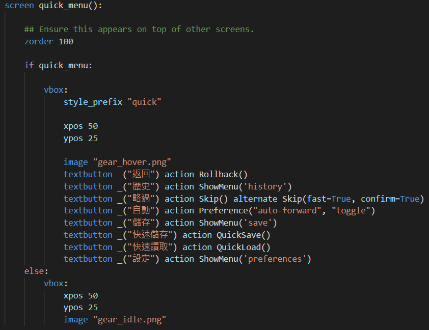
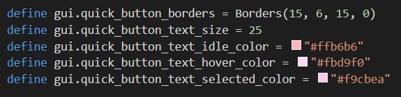

title: 'Ren''Py: customize quick menu'
author: int
tags:
  - Ren'Py
  - ''
categories: []
date: 2022-05-29 11:06:00
---
[上一篇文](https://huanginch.github.io/2022/05/26/RenPy-hide-quick-menu/)介紹到如何隱藏quick menu，這篇要來介紹如何自訂quick menu。 其實應該要先寫這篇的，不過因為當時我被如何隱藏菜單搞了很久，想說好不容易解決就先記錄一下，所以這篇算是填坑。

## 自訂screen.rpy內容
找到screen quick_menu():的地方就可以自訂quick menu的內容、位置等等

像我這裡就改了x、y座標，加了一張image，也把一些英文的按鈕改成中文顯示。

## 自訂gui.rpy內容
在gui.rpy裡找到包含quick關鍵字的程式碼

這邊就可以自訂按鈕的顏色、字體大小等等，像我就把它改成粉色，字體大小25 

相較於隱藏菜單這個簡單多了，不過當時也是找如何改顏色找了一陣子，原來要從gui改，一直以為要在screen.rpy裡修改，那時候是參考了[這系列影片](https://www.youtube.com/playlist?list=PLKdE0Vv4UA5-dqJLpDkPt5CLQzc6hJ-uh)，分享給大家。