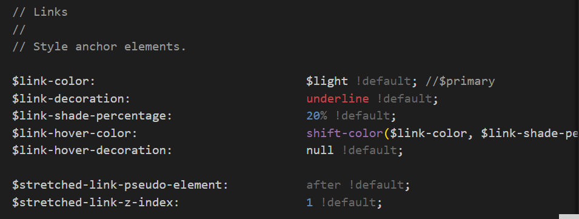

title: 'SCSS: !default'
author: int
tags:
  - css
  - scss
categories: []
date: 2022-08-27 19:47:00
---
在scss中有個語法叫!default，與css中的!important有點像是相反的存在，關於!important可以參考[這篇](https://huanginch.github.io/2022/07/05/css-important/)，不過!defult是scss特有的，css並沒有。


如果在屬性後加上!default他會變成類似預設值的存在，權重最低，可以用任何方式覆蓋。

通常會用在scss的變數上

```scss
$primary: blue !default;
```

舉例來說bs5中的 `_variable.scss`檔案的許多變數都有使用到!default。



## 結語

今天這篇沒有介紹scss就直接介紹了!default，之後會補齊關於scss的文章。