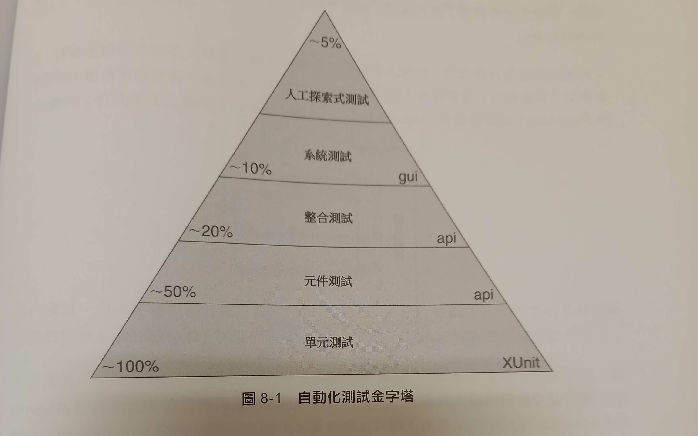

title: 「The Clean Coder」閱讀筆記
author: int
tags: 'clean code, clean coder, book review'
date: 2023-02-28 17:12:21
---
> 我猜，你之所以拿起這本書，因為你是程式設計師，"專業主義"這個說法吸引了你。你就該如此。我們這種專業人士迫切渴求的，正是，"專業主義"。

這段話是出自 「The Clean Coder」 這本書序章的一段引文。沒錯，我拿起這本書正是因為我希望自己成為一個專業的程式設計師。

這本書作為 「The Clean Code」 的姊妹書，我想大多數人應該都是從 「The Clean Code」 這本書開始看起，不過我並沒有這樣做，單純只是我對於這本書的重點「專業主義」以及身為專業程式設計師該有何態度感到興趣。實際上這兩本書也沒有所謂的觀看順序，只要你有興趣，就可以從任何一本書開始閱讀。

## 專業主義
這章節的重點在於身為專業人士該清楚知道自己想要什麼，並對自己的專業有所負責。最讓我印象深刻的是職業道德的部分，裡面提到「你應該計畫每週工作60小時，前40小時是給雇主的，後20小時是給自己的。」書中也提到這20小時該拿來學習新知，增加自己的專業能力。很常會聽見一些前輩說每當投入職場往往沒有多餘的時間學習新知，但依照書中算法，一天工作8小時，扣掉睡眠時間與學習時間，一週甚至還有多餘的52小時可以去做學習以外的事。我猜想這也跟台灣職場的加班文化也有關係。

## 說「是」與說「不」
對於做不到的事情必須堅決說不，即便上頭給了時間壓力，也不要因而退讓說出「試試看」這種話，因為這樣往往會導致後面你將花上更多心力去彌補在不足的時間內趕出來的程式。開發上的時程只有你自己最清楚，所以你必須要對自己的時間有所掌控，並且要能夠說出「我需要多久時間完成這件事情」。

對我來說這件事真的很難以想像，畢竟我還沒有真正的工作經驗，而且我認為我是個容易妥協的人，但我想這也是一個很重要的能力，因為這樣才能夠讓你在工作上有所作為，而不是被動的接受工作的安排。現在開始我必須時時刻刻告訴自己，做不到就是做不到，不要因為時間壓力而妥協。

相對於說「不」，對專業人士來說，說「是」是一種承諾，同樣的要避免說出「我們應該試試...」之類的話，直接說出「我將在...之前完成這件事情」，這樣才能夠讓你的上司知道你的承諾，並且讓你的上司也能夠更好的安排工作。

懂得說「是」與「不」才能讓你的話聽起來更讓人信服，也使得你表現得更為專業。

## 寫程式
這章節提到了在寫程式時該使用什麼樣的態度，避免讓自己處於精神不佳的狀態下工作，熬夜加班趕工只會使得寫出來的程式碼一團糟，這裡也呼應了專業主義中提到的時間安排，以及透過說是與說不來自己不會陷入需要加班趕工的重要性。

### 避免進入流態區(Tne Flow Zone)
這段其實讓我很意外，所謂的流態區指的是寫程式時偶爾會進入的狀態，那時候的我會寫得渾然忘我，專注力與生產率提高，覺得自己無所不能，我相信很多人都有這樣的經驗，一直以來我都認為進入這種狀態是件好事，但書中提到這種狀態會讓你的理性下降，並且被打斷時可能會變得暴躁易怒，所以應該避免進入這種狀態。
> 程式設計師大多自負、固執、內向

這句話真是說到我心坎裡了，除了不夠自負，我承認我固執又內向，所以我也可能因為被別人打斷而感到不開心，畢竟我也沒有特別喜愛與人交流，不過被打斷時千萬記得對於過來請求你幫助的人隨時都要有禮貌，因為你有天可能也會需要求助於他們，你也不會希望你向他們求助時他們以糟糕的態度回應你。

### 阻塞與保持節奏
總是會有那種死活都寫不出程式的時候，這時候需要的是轉換心情，起來動一動，或是去喝杯咖啡，這樣才能夠讓你的大腦重新清醒，並且重新思考問題，或是找個夥伴一起做 Pair Programming。(老實說 The Clean Coder 這本書中並沒有詳細介紹 Pair Programming 該如何實現，但卻不斷地提到他的重要性，並且強調專業的程式設計師該時時刻刻進行 Pair Programming，我想等我開始閱讀 The Clean Code 就能一探究竟了)。也要適時停止工作，回家洗個澡休個息避免超時加班。平時也可以看一些無關的書籍，讓自己的大腦有所休息，書中稱這為創意輸入，觀看某些特定書籍或影片反而更能激發自身的創意。我想對我來說的創意輸入應該會是漫畫和小說，特別是奇幻小說，他們確實能夠讓我想像力更加豐富。

## 測試驅動開發(TDD)
>TDD是專業人士的選擇
這章節提到了測試驅動開發的重要性，這是一種開發方法，也是一種開發態度，這種開發方法的核心是先寫測試，再寫程式，這樣才能夠讓你的程式碼更加乾淨，也能夠讓你的程式碼更加容易維護。必須說雖然這不是我第一次聽過TDD，但是這是我第一次真正的了解到TDD的重要性，這也是我第一次真正的了解到TDD的核心。

### TDD的三大法則
1. 在撰寫任何程式碼之前，先撰寫一個失敗的測試。
2. 只撰寫剛好無法通過的單元測試，不能編譯也算無法通過。
3. 只撰寫剛好能通過當前測試的產品程式碼。

遵循這三個法則大概就能以每30秒一次的速度寫出一個測試，不但速度快也使得你的程式碼更容易維護，為了符合測試情境，你就會盡可能找出最好的設計。

## 練習
這章節提到了練習的重要性，練習可以讓你的技能更加精進，不管是開發速度還是思考速度都可以透過練習來提升。

### 程式柔道設計場(Coding Dojo)
很有趣的是，許多用於程式練習的專有名詞都是武術名詞，Coding Dojo是一個由志願者主導的全球性社區，為年輕人提供免費的程式研討會，作者當時也參與了這種活動，裡面有許多練習程式的方式

1. Kata
   Kata一詞出自日文的「型」，意思是「形式」，指的是單獨練習的武術動作的詳細的動作編排模式。在程式設計中，Kata 是對於一個題目的反覆練習，而不是針對如何去解題來做訓練，作者提到他最喜歡的 Kata 是 [Bowling Game Kata](http://butunclebob.com/ArticleS.UncleBob.TheBowlingGameKata)，這是一個計算保齡球遊戲分數的題目，這個題目的難度不高，但是卻能夠讓你練習到許多程式設計的技巧，例如：重構、設計模式、TDD等等。我也因為這次的閱讀，才知道了這個題目，並且我的第一次TDD體驗就獻給了Bowling Game Kata，我使用了Javascript + Mocha.js + Chai.js來實作這個題目，也有照著作者提供的步驟透過Java來實作，非常有趣，歡迎大家可以試試看。
2. Wasa
   Wasa基本上就是兩個人的Kata，一個人寫測試，一個人寫產品，並且兩個人必須同時進行，完成後再交換角色，這樣可以讓你更加了解對方的程式碼，並且可以讓你更加了解對方的思考方式，這樣也能夠讓你的程式碼更加乾淨。
3. 自由練習(Randori)
   自由練習就是兩個人以上的Kata，每個人都可以寫測試或是產品，並且要一個接續一個，你寫的產品通過了測試，就輪到下一個人寫產品。

## 驗收測試
驗收測試的重要性在於確保產品有符合顧客、業務、開發方與測試方的需求，避免出現因為溝通上的問題而導致的產品錯誤。
溝通一直是個很大的成本，即便我還沒正式有工作經驗，也能從一些學校的分組報告中感受到，當你有個組員只會說好或是什麼都不說，很可能他做出來的東西和你預期的完全不相同，時刻確保對方真的有了解自己的想法很重要。

### 自動化測試
使用人工來進行測試的成本太過昂貴，所以必須進行自動化測試，而自動化測試產生的文件也能用來當作評估是否有達到需求的文件。直到今天我才了解為何常常會在網路上看見自動化測試的詞了，因為他就是如此重要。

### 驗收測試的人員與時間點
理想狀態下必須由業務與QA共同進行測試，這也讓我很意外，我以前以為測試就是QA的工作，與業務無關，不過實際上業務通常也不會有時間來進行測試，所以多數還是只交給QA來進行。而測試的重點在於寫測試與開發產品的人必須不同。

### 持續整合(CI)
持續整合是一種開發模式，它的目的是讓開發者能夠在每次提交程式碼後，就能夠立即知道是否有破壞程式碼，這樣就能夠讓開發者能夠在破壞程式碼之前就能夠修正，這樣就能夠減少破壞程式碼的機會，也能夠讓開發者能夠更加快速的開發。我第一次體驗是在 Linux 核心實作這堂被我拋棄的課上，只要提交一次程式碼到 github 上，git action 就會自動進行測試，並將測試結果 email 到我的信箱，只能說 Linux 核心實作的課程真的很棒，短短一週就體驗到完全沒體驗過的開發經驗，只可惜我目前沒有多餘的時間來處理他的作業，只能說是沒有緣分。

## 測試策略
QA有幾個要點:
1. QA 應該要找不到任何錯誤
   即便 QA 可能屬於另一個獨立部門，開發部門依舊要以 「QA 應該要找不到任何錯誤」為目標。
2. QA 也是團隊的一部份
   看起來 QA 好像與開發團隊是對立面，但實際上 QA 也是團隊的一部份，QA 與開發團隊的目標是一樣的，都是要讓產品能夠正常運作，所以 QA 也是團隊的一部份。
3. QA 是需求規約定義者
   QA 做的是向業務收集需求，並且將需求轉換成測試案例，一般來說業務所撰寫的是針對正常路徑(happy path)所做的測試，而 QA 是針對極端情況、邊界值與異常路徑(unhappy path)所做的測試。
4. QA 是 特性描述者
   QA 回報時會描述系統運行的真實情況，所以並不是在翻譯顧客或是業務的需求，只是在鑑別系統是否有達到需求。

### 自動化測試金字塔

這張圖說明了自動化測試的幾個階段，從下到上分別是:
1. 單元測試
   單元測試是由與開發產品相同的語言撰寫的測試，並且測試的範圍是單一的函式，這樣的測試可以讓開發者能夠快速的知道自己的產品是否有錯誤，並且能夠快速的修正。TDD 中先寫測試再寫程式碼的概念就是來自於單元測試。
2. 元件測試
   元件測試是驗收測試的一種，由業務與 QA 共同進行，並由開發人員進行補助。通常需要在 FITNESS、JBehave、Cucumber 等元件測試環境下來進行測試。目的是要讓「不具備編寫測試能力的業務人員也能理解這些測試」。
3. 整合測試
   這種測試只適合元件很多的產品，將元件組裝後測試他們彼此之間是否能正常通訊，一般由系統架構師與首席設計師來編寫。整合測試不會作為持續整合的一部份，因為持續整合區要週期性的執行，而整合測試的時間成本較高，所以不適合作為持續整合的一部份。
4. 系統測試
   用來測試系統是否已經組裝完畢，通常由系統架構師與技術負責人來編寫，一般使用與UI整合測試相同的語言和環境來進行測試。
5. 人工探索式測試
   這個階段就是需要人工介入，不寫任何腳本，目的是為了模擬使用者的操作，並盡可能找出無法預期的錯誤。

## 時間管理
時間管理對於任何人來說都是個重要的議題，如何在有限時間內完成任務，書中也提了幾個令我感到驚訝的觀點:

### 會議
會議的兩條真理
1. 會議是必要的
2. 會議會浪費大量的時間

所以只參加必要的會議，有些會議邀約要懂得適時拒絕。這讓我很訝異，因為我一直以為會議不能拒絕，畢竟有時候會議的邀請是來自於上司，感覺自己沒有那個立場可以拒絕，書中甚至提到可以禮貌的在會議中提出自己似乎與本場會議無關希望提早離席，至少現在我不認為我做得到，但我也意識到這麼想的自己是不是就是不夠專業，能夠有效的掌握自己的時間並且懂得拒絕不必要的會議才是專業人士該有的作為，我想這也只能之後慢慢自己摸索了。

### 爭論
如果一件事無法在5~30分鐘內解決，那爭論就是沒有意義的，不如花時間去蒐集資料讓資料來說話。

### 番茄鐘工作法
以一個番茄鐘為單位，每個番茄鐘為25分鐘，每個番茄鐘後休息5分鐘，每四個番茄鐘後休息30分鐘。
也是一個我早有耳聞卻從來沒有實踐過的東西，直到這次我才開始嘗試，本來以為能夠長時間專注的我不需要番茄鐘工作法，但這方法意外的很適合我這種不愛休息的人，因為適度的休息能夠回復專注力，我很常在一整天的長時間專注後感到很疲倦，自從使用了番茄鐘工作法我強烈感受到每個工作週期我的效率與專注度都沒有太嚴重的下滑。

### 死胡同與泥潭
開發陷入死胡同很容易發覺也很容易讓人知道要放棄，但在泥潭中你還能前進，實際上卻是你花了更多心力在泥潭中前進，其實從頭來過會是更快的方法。這點我也有感受，有時候在開發時會覺得某些方法不是很好，但至少能用，但最後發現直接重寫遠比用這種不好的方法來的快，但我也不是很能夠在開發中就能夠判斷出我是否陷入了泥潭中，所以我想這也是我需要多多練習的地方。

## 預估
最簡單也最困難的東西，你身為專業人士自然能知道自己大概要花多少時間進行開發，但同時你給出的時間也是一個承諾，如果開發到一半發現自己預估錯誤一定要馬上和團隊成員反映，以減少對整個團隊的影響。我也清楚知道這有多困難，我當然會想在自己承諾的時間完成工作，而我又是個極度守承諾的人，我想這也是我該學習的地方: 勇於面對自己的預估錯誤。

## 協作、團隊與專案
即便多數身為程式設計師的人都是不愛與人打交道才會成於此行的，但在團隊中你還是需要與人打交道，不管是與團隊成員、業務、客戶或是上司，你都需要學會如何與他們溝通，這也是我覺得這本書最有價值的地方。

### 結對程式設計(Pair Programming)
前面也提過這本書不斷強調結對程式設計，也認為專業的程式設計師平時就該用結對程式設計，與別人一起思考問題可以提升效率。我想我在閱讀 The Clean Code 時會認真地了解這個概念(畢竟本書沒有細提)。

## 工具
本篇列舉了一些開發上必備的工具

1. git - 版本控制
   git 的重要性我想不用多說，作為現在主流的版本控制工具，git基本上是所有程式設計師該學的工具之一。
2. 編輯器
   裡面提到了vi、emacs等等，但我最愛用的還是 VSCode ，雖然書中沒有提到，但這已經是現今主流的編輯器，社群龐大，插件豐富，而且還有很多大公司的開發者維護的插件，這是我最愛的編輯器(而且個人覺得 emacs 超難用)。
3. 問題追蹤
   Private Tracker 是作者使用的工具，不過這些我都沒有使用過，也是第一次聽說。
4. 持續建置
   Jenkins，而我自己也只用過 git 的 actions
5. 單元測試工具
   JUnit、NUnit、Midje 等等，視你使用的語言而定，像我開發 Javascript 就有用到 Mocha、Chai 等等。
6. 元件測試工具
   FitNesse，這是作者開發的軟體，在書中可以看到作者一直提到。

## 結語
寫了這麼長終於是到了尾聲，這本書的內容對於我來說啟發真的很大，不論是帶我進入 TDD，還是開始使用番茄鐘，甚至我以前也不會寫閱讀筆記，我也會繼續努力的學習，希望能夠成為一個更好的程式設計師。