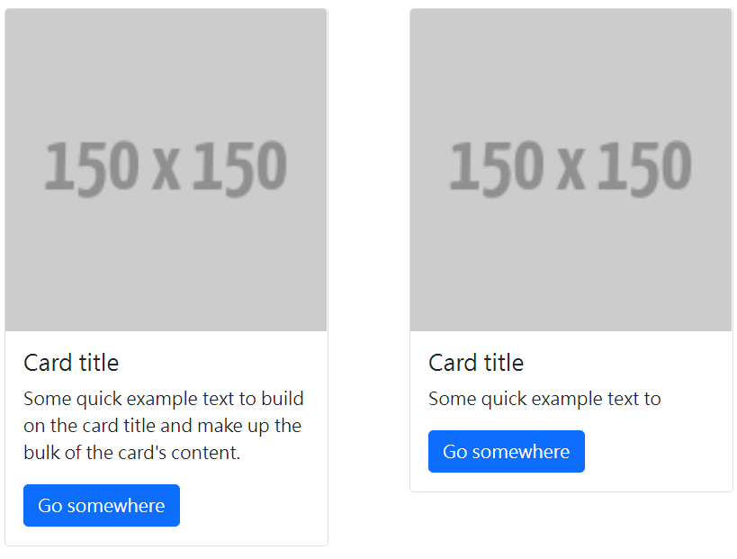
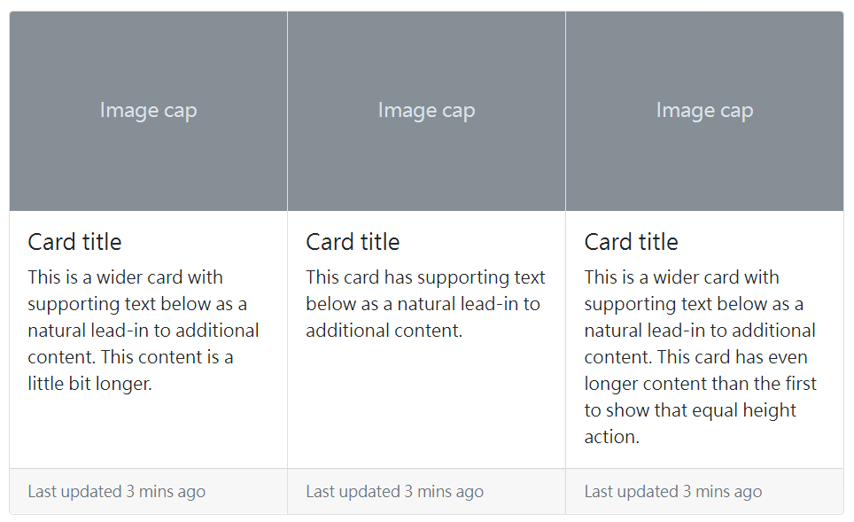

title: 'bs5: 卡片元件等高'
author: int
tags:
  - css
  - bs5
  - ''
categories: []
date: 2022-08-19 16:09:00
---
之前我有介紹過bootstrap的[卡片元件](https://huanginch.github.io/2022/08/14/bs5-card/)，不過在使用這個元件時都會遇到一個問題，就是卡片會自適應內容而導致每張卡片高度不同，這篇會來介紹如何讓卡片元件等高以及在RWD的情況下該如何排版。

## 方法一

* 使用card-group與card-footer。

如果我卡片用card-group包裹起來，並為他們都加上card-footer，那麼卡片高度就會自動對齊。

不過這種方法有個問題，他不支援小螢幕下換行，也就是說在RWD方面不是那麼的理想，所以一般來說會使用方法二。

## 方法二

* 使用網格排版與h-100

為每個卡片元件下col，透過bs5的網格系統達成不同螢幕比例下會自動換行。再來是透過在card上使用h-100讓卡片稱滿，使得所有卡片高度相同。

不過這裡有個小地方要注意，換行後稱滿的卡片與下行的卡片之間會沒有間距，所以要透過在col上下margin-bottom來讓卡片之間有間距。

<iframe height="300" style="width: 100%;" scrolling="no" title="Untitled" src="https://codepen.io/intHuang/embed/WNzPvJo?default-tab=html%2Cresult" frameborder="no" loading="lazy" allowtransparency="true" allowfullscreen="true">
  See the Pen <a href="https://codepen.io/intHuang/pen/WNzPvJo">
  Untitled</a> by int (<a href="https://codepen.io/intHuang">@intHuang</a>)
  on <a href="https://codepen.io">CodePen</a>.
</iframe>

* 如果是使用scss來開發可以在_variable.scss中找到card-height屬性，將它改為100%就不用手動一個一個加上h-100。