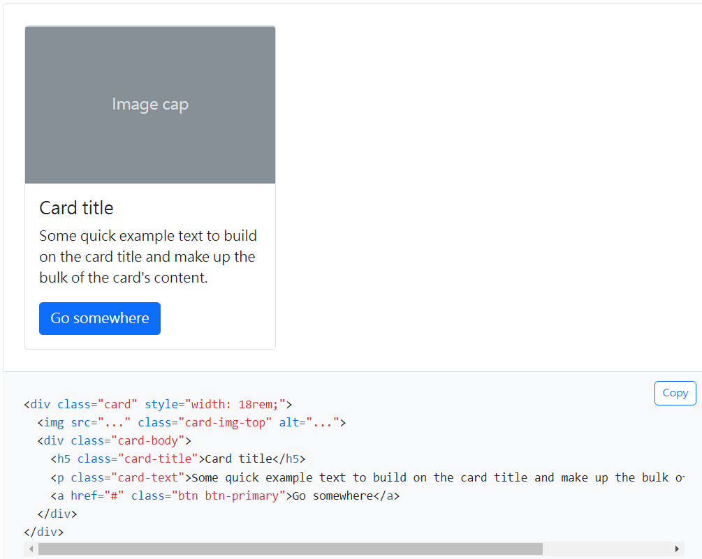
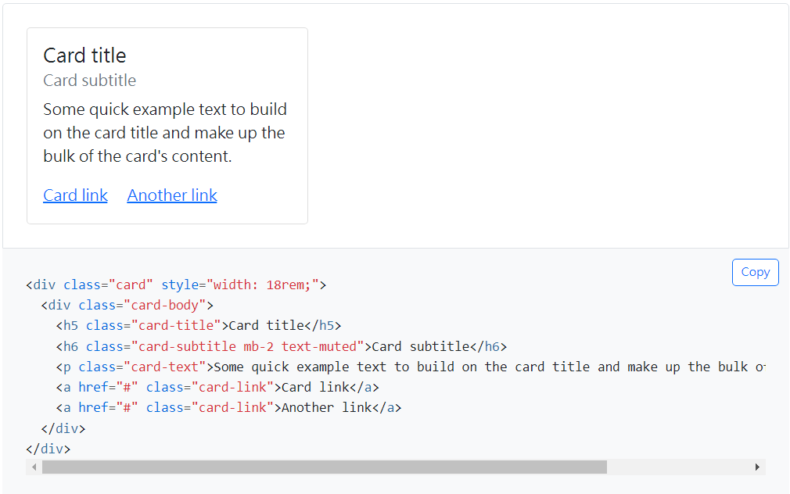
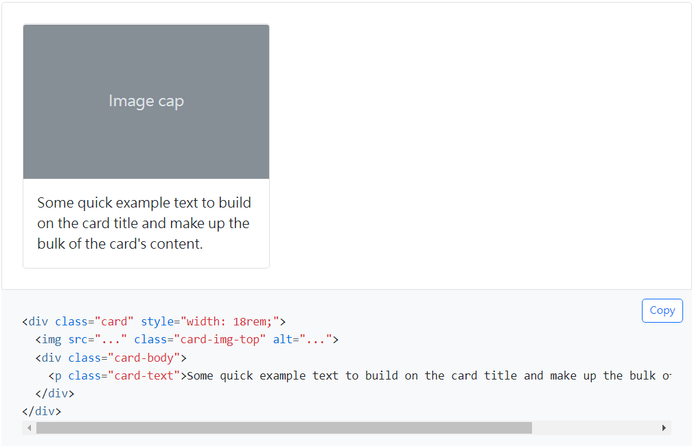
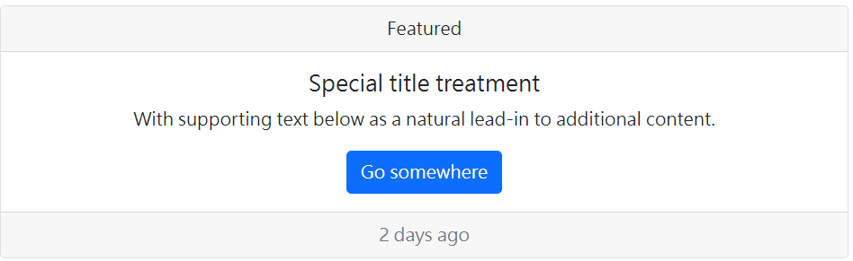

title: 'bs5: card'
author: int
tags:
  - bs5
  - css
categories: []
date: 2022-08-14 02:43:00
---
卡片是另一個很常用的元件，除了有寫好的排版，內容也能克制化。

## 語法

card最外層要用card class包住，內容用card-body包住，也可以視情況加入image、card-header。

## card-body

card-body內可以放入各種內容，文字、圖片、標題、列表等等都有相對應的class可以使用，更多可以參考[官方文件](https://getbootstrap.com/docs/5.0/components/card/)。

## card-header、card-footer

header和footer分別會在卡片上方和下方加上邊界以及背景

