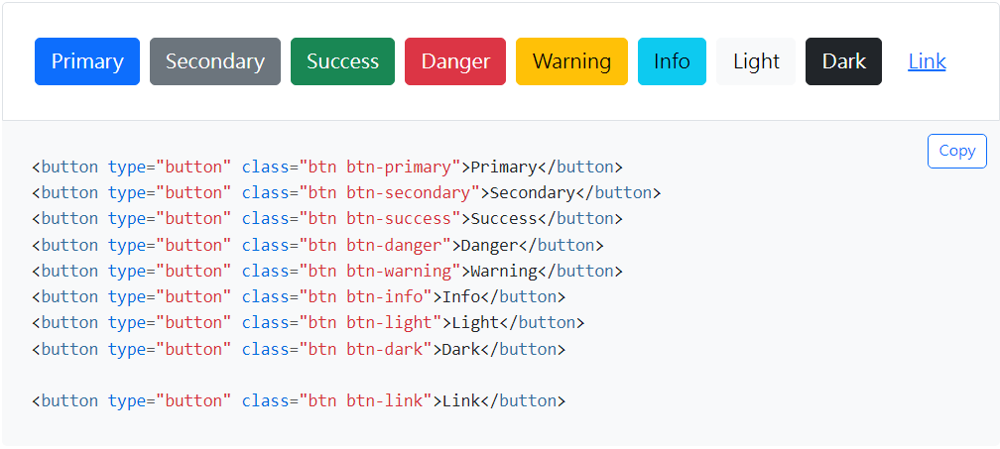
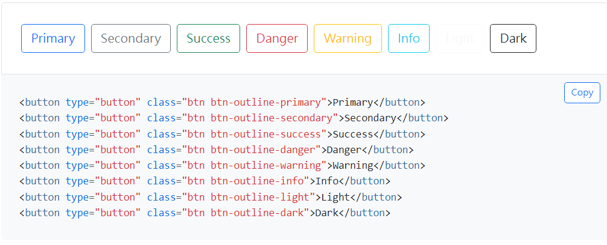
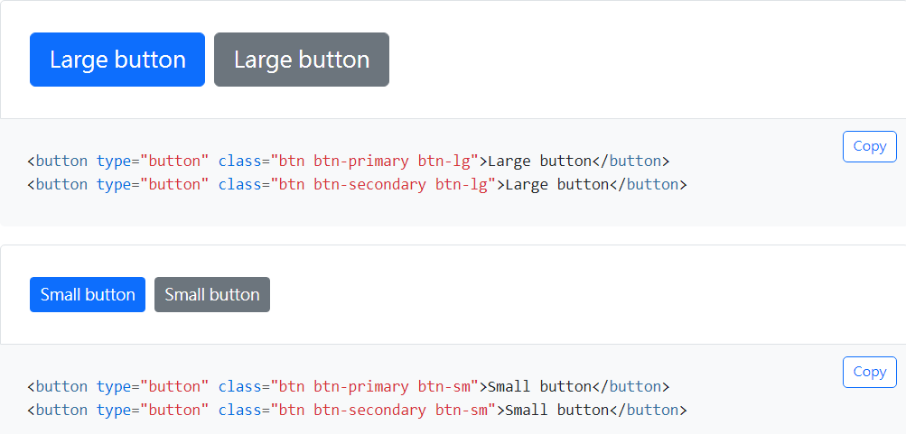

title: 'bs5: button'
author: int
tags:
  - bs5
  - css
categories: []
date: 2022-08-12 16:27:00
---
button是bootstrap提供的一個元件，可以觀看[官方文件](https://bootstrap5.hexschool.com/docs/5.1/components/buttons/)，而這篇會簡單介紹如何使用button以及button這個元件是如何運作的。

## 使用

button可以使用在button、a以及input三個tag上，一般來說我都會選擇a或是input，在tag上加入btn class就完成了button元件的引入。

```html
<a class="btn">button</a>
```

### 樣式

button提供了不同種類的預設樣式，最常使用的就是這種實心按鈕，只需要寫上對應的class就能獲得對應的顏色以及hover effect。

`btn-primary` `btn-secondary` `btn-success` `btn-danger` `btn-warning` `btn-info` `btn-light` `btn-dark` `btn-link`



除了實心也有提供只有外框(outline)的按鈕樣式

`btn-outline-primary` `btn-outline-secondary` `btn-outline-success` `btn-outline-danger` `btn-outline-warning` `btn-outline-info` `btn-outline-light` `btn-outline-dark` `btn-outline-link`



### 尺寸

也有提供大小不同的按鈕，使用方法一樣是加上對應的class即可。

`btn-lg` `btn-sm`



### 狀態

button還可以新增其他狀態，例如禁用、啟用等等

* disable:
	禁用屬性直接加上disabled即可
    ```html
	<button type="button" class="btn btn-lg btn-primary" disabled>Primary button</button>
	```
    不過在a標籤比較特別，因為a標籤本身沒有disabled屬性，所以要改加在class上，bs5同樣為a標籤撰寫了禁用的樣式
    ```html
	<a class="btn btn-primary btn-lg disabled" role="button" aria-disabled="true">Primary link</a>
	```
* active:
 	想讓按鈕為active狀態可以加上 `data-bs-toggle="button"` 或是加上 `.active`這個class
    
    ```html
	<button type="button" class="btn btn-primary active" data-bs-toggle="button" autocomplete="off" aria-pressed="true">Active toggle button</button>
	```
    
## 結語

按鈕不只是上述介紹的而已，還能夠加上其他的class來達到與其他元件互動的效果，不過這部分讓我留到介紹需要使用按鈕作互動的元件時再來談吧。
 
 