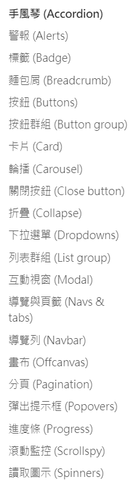
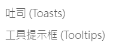
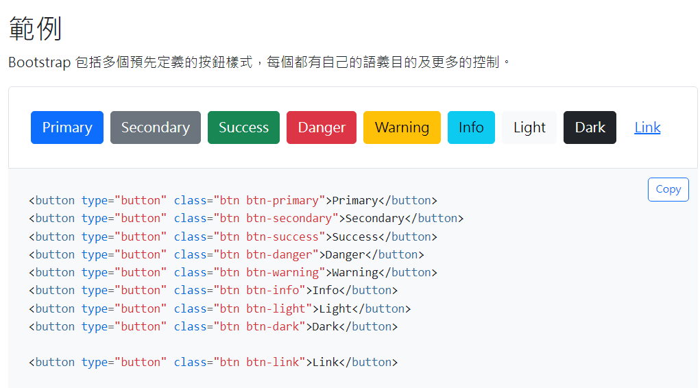

title: 'bs5: component'
author: int
tags:
  - bs5
  - css
categories: []
date: 2022-08-12 01:57:00
---
在bootstrap中最強大的功能就是他所提供的元件(component)，所謂的元件是由bs5所提供事先寫好的、可重複利用的元素，比如說按鈕、navbar、card等等，他們會有固定的樣式與功能，當我們要使用時就可以直接套用，不用自己從頭寫一個。

## 元件種類

bs5提供許多元件，比較常用的有button、navbar、tab、card等等，下面這兩張圖列出了所有bs5有提供的元件。

## 使用元件

想要使用元件可以到相對應的文件，以按鈕為例，先進入按鈕的[文件](https://bootstrap5.hexschool.com/docs/5.0/components/buttons/)

再來選擇範例的樣式，複製下方程式碼貼到自己的編輯器上，就可以獲得與範例相同的按鈕(記得先引入bs5)

想要客製化可以依照下方其他範例做修改，更詳細的客製化方法在本篇不會介紹，之後會獨立一篇出來介紹。

## 結語

元件比較困難的地方大概是要理解他寫好的class在做什麼才能做到客製化，我自己一開始在使用也是有點不知道從何下手，不過多用幾次就會發現非常方便，因為都幫你寫好了。