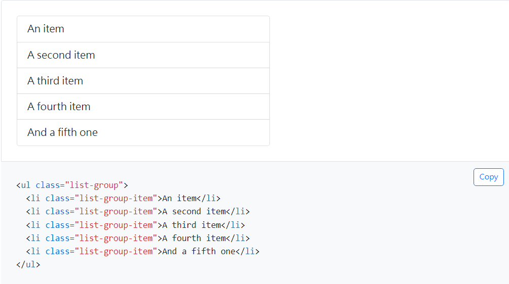
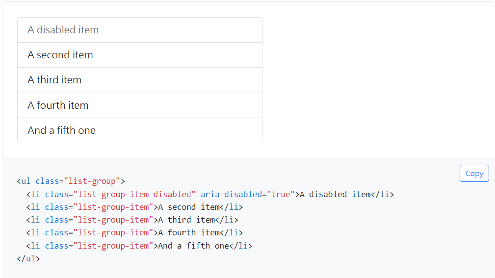
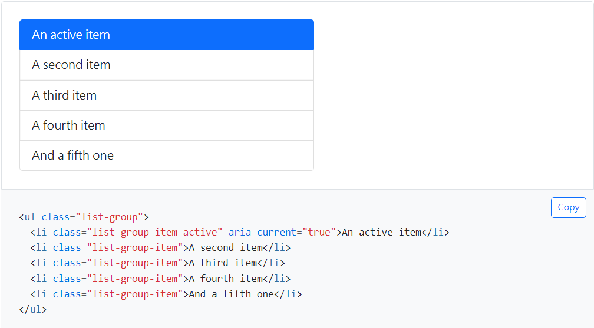
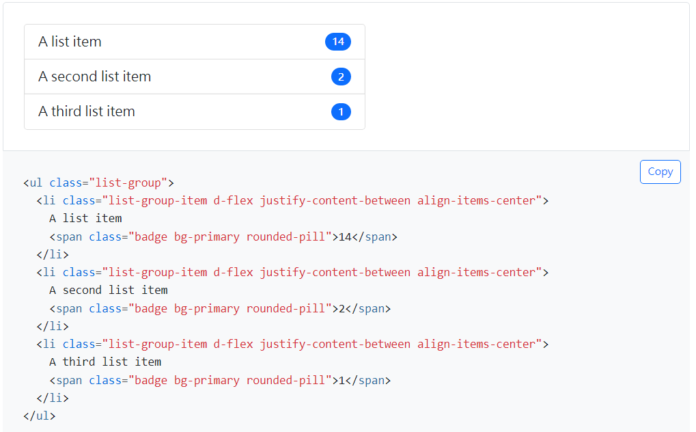
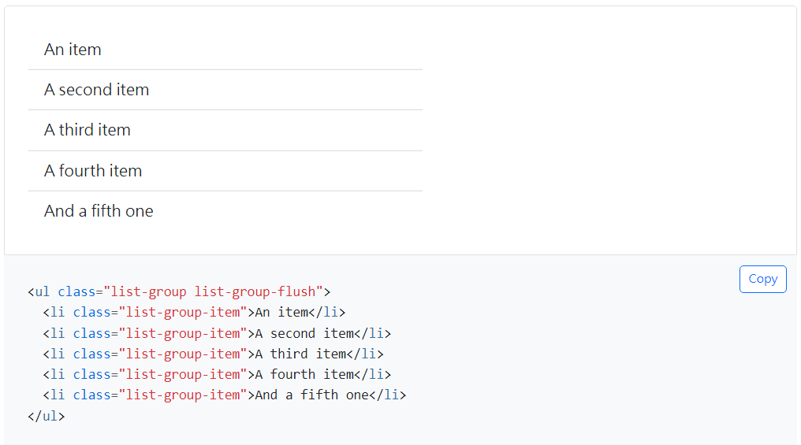
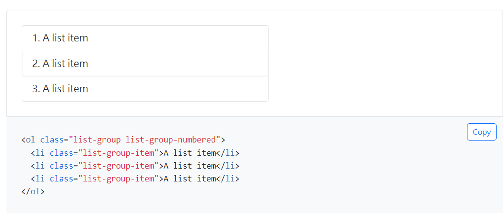
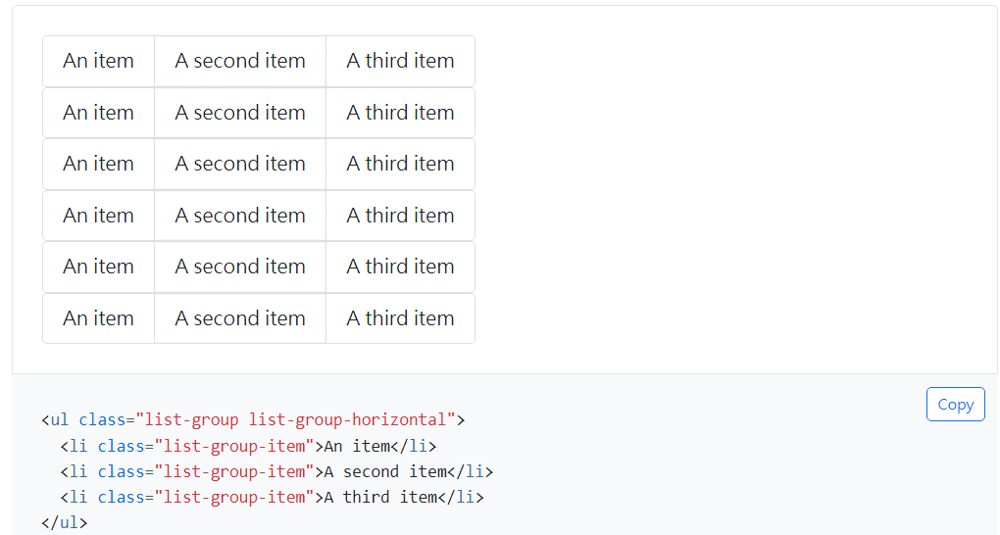

title: 'bs5: Listed Group'
author: int
tags:
  - bs5
  - css
categories: []
date: 2022-08-14 23:42:00
---
群組列表是bs5中的一個元件，使用的是一般的ul結構，不過bs5有為它制定了樣式。

群組列表由外層的list-group和內層的list-group-item組成。

* 最基本的群組列表

## 狀態

群組列表同樣可以新增`disabled`、`active`等狀態

* disabled: 將`disabled` class新增至對應的list-group-item上可以讓它呈現禁用狀態(如圖)。

* active: 將`active` class新增至對應的 list-group-item 上可呈現啟用狀態(如圖)。

## 列表內容

列表內容可以不是單純的文字，連結、按鈕、圖片等等也都是可以放入列表中的，其中比較特別的是通用標籤。

* 通用標籤是藉由新增通用類別來增加標籤這個樣式

## 移除邊框與圓角

預設的列表樣式是有邊框與圓角的，加入`.list-group-flush` class 可以移除

## 其他樣式

* 常用的前面帶有數字的ol在列表群組也有類似的樣式可以使用，在`list-group`後方新增 `list-group-numbered` class 即可

 
* 想要將列表改成水平的也是可行的，只需要加入`list-group-horizontal`class即可。

