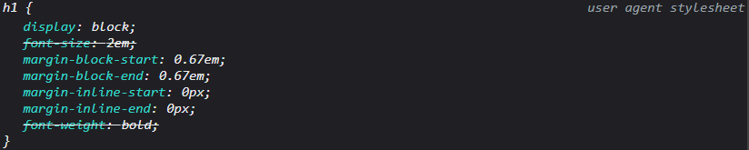

title: 'CSS: 區塊元素與行內元素'
author: int
tags:
  - css
categories: []
date: 2022-06-08 11:47:00
---
在css中有許多元素，今天來介紹最常見的兩種元素: 區塊元素與行內元素。

## 區塊元素

### 語法
```css
display: block;
```
想確認一個標籤預設是不是區塊元素，可以透過chrome瀏覽器的開發者工具觀看。如下圖以h1為例，找到user agent stylesheet就可以看到h1裡面有一行 **display: block;** 這代表了h1為區塊元素。



### 特性
* 會盡量佔滿整個版面:<br/>如下圖所示，我寫了兩個h1標籤，並為他們的背景加上顏色，可以看到幾乎佔滿了整個版面，有些留白的部分示我為了方便觀看加上的margin(上下各2px)

	

* 會另起一行:<br/>同上圖，我寫了兩個h1，但他們並沒有排在一起，而是各佔了一行

## 行內元素

### 語法
```css
display: inline;
```

### 特性
* 常用於p段落內: <br/>和區塊元素不同，行內元素會如下圖所示，這裡我使用了兩個a標籤，可以看到他跟h1不同，並不會另起一行，也不會佔滿整個版面，所以很常被拿來在p段落裡面使用。


* 無法設定寬高:<br/>不論你增加多少寬高給行內元素，他都不會有任何改變，如果希望行內元素能夠有寬高，就要將它改成區塊元素，可以用display:block;來達成。

這篇介紹差不多到這，還有其他的常用元素，以後也會找機會介紹。