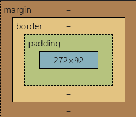
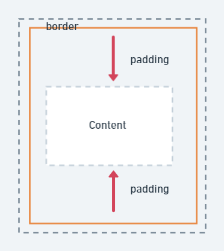
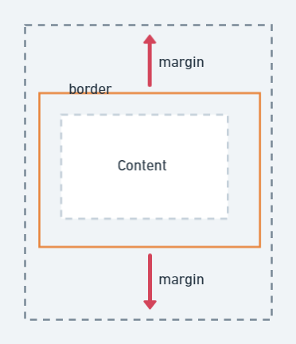
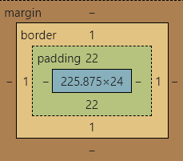

title: 'CSS: 盒模型'
author: int
tags:
  - css
categories: []
date: 2022-06-30 11:17:00
---
說到css就不能不提他最重要的觀念-盒模型(box model)，在css眼中，所有元素都是以盒模型方式呈現。盒模型由以下幾種東西組成: 內容(content)、內邊距(padding)、邊界線(border)、外邊距(margin)。

* Chrome 開發者工具中的盒模型(打開開發者工具後拉到style最下面可以看到當前選取元素的盒模型)

知道盒模型長什麼樣子之後，那他到底是來幹嘛的? 簡單來說，它可以用來推算元素在網頁上佔的位置大小，方便我們對元素做排版，接著我會一一介紹盒模型的四個組成要件。

## 內容(Content)
內容就是元素內容，img就是圖片，p段落就是文字等等，任何你真正想在網頁上呈現的東西。

## 內邊距(Padding)
內邊距是在元素內產生的留白，分為上下左右，可針對不同方向產生不同推擠，方向上來說是從邊界線開始項內容推。

## 邊界線(Border)
元素最外層的界線，邊界線除了讓我們方便分清楚元素與元素之間的界線外，也可以用來當裝飾。因為邊界線也會有大小，自然會算進去盒模型的大小中，同樣分為上下左右四個方向。

## 外邊距(Margin)

和padding相反，margin是元素外產生的留白，從邊界線開始由內而外推擠，同樣分為上下左右四個方向。

## 元素大小計算

那知道了盒模型是由什麼組成之後就可以來計算元素的大小了，一般來說我們都會認為元素的大小只有content大小，但如果有加上padding和border就會跟這一起算進去。

以這張圖來說，元素的寬會是內容的24+左右兩邊的border，所以是24+1+1 = 26，長度則是225.875 + 22 + 22 + 1 + 1 = 271.875。 你可能會想問，那margin呢？ 不用算嗎？沒錯，margin並不算在元素的大小上，但是仍然會在網頁上留下空間，所以在寫的時候要特別注意。

## 總結
盒模型基本上是css的核心概念，要學好css一定要學好盒模型，當然你會覺得每次都要自己計算很麻煩，所以css也有提供其他方法，這邊我會留到下一篇來介紹。

