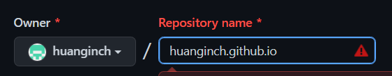

title: 如何部屬HEXO到github.io(deploy on github)
author: int
tags:
  - hexo
categories:
  - hexo introduce
date: 2022-05-22 11:18:00
---
[上一篇文](https://huanginch.github.io/2022/05/21/hexo-admin-deploy/)提到了如何使用Hexo admin來部屬網站，但要部屬網站就要有相對的網域來讓你發佈，而github.io即是一個很常拿來發佈靜態網站的地方，這篇文就要來介紹如何使用github來發佈靜態網站。

## 步驟
1. 註冊github: https://github.com/
2. 到自己的個人頁面，按下repositories旁邊的new


3. 在名稱欄位輸入username.github.io(username是你註冊的帳號名稱)，因為我已經註冊過了所以會有紅字

4. 拉到最下面按下create repository

5. 接著到你安裝HEXO的blog資料夾，打開 **_config.yml**
6. 拉到最底下找到 **deploy:**，並輸入以下文字，同樣的username也是你的github帳號名稱
```
deploy:
        type: git
        repo: https://github.com/username/username.github.io.git
        branch: master
```
基本上這樣就算完成了，你可以按照上篇文的步驟按下admin的deploy就可以部屬網站到github.io上，又或者你可以在終端機輸入以下指令:
```bash=
hexo cl
hexo g
hexo d
```
	*  hexo g和hexo d也可以合併替換成hexo g -d
 <p>完成後你可以前往自己的github.io網站(https://username.github.io/) ，你會看到網站成功出現，不過有時候他不會那麼快更新，你要稍等一下</p>
 <p>以後如果要更新文章或是發布文章也只需要輸入最後那三個終端機指令，或是直接使用admin的deploy即可，那這篇文差不多到這邊，有任何問題歡迎和我提出。</p>