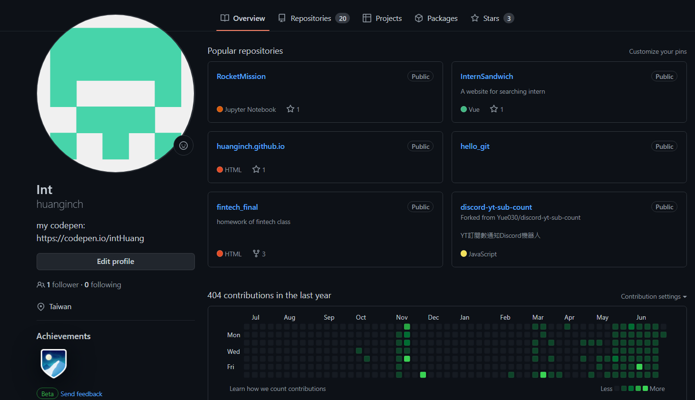
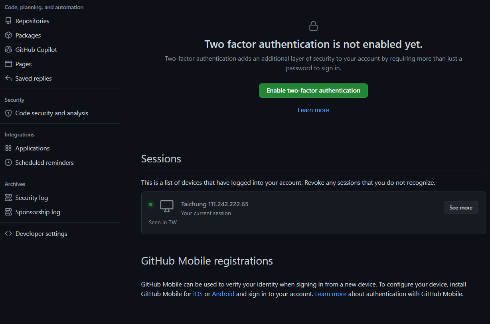
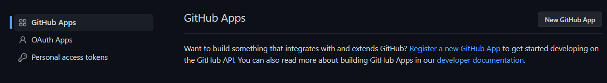
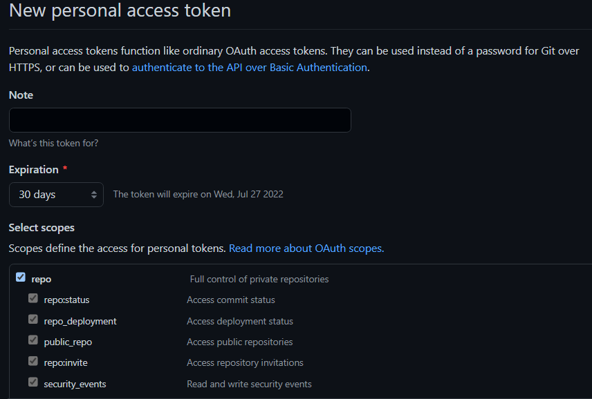

title: 'Github: Personal Access Token'
author: int
tags:
  - git
  - github
categories: []
date: 2022-06-27 00:05:00
---
github在最近的更新對遠端推送作出了安全性的限制，以前推送時只要輸入帳號密碼即可，現在推送密碼的部分要更改成personal access token，這篇文就會來介紹如何新建一個token。

1. 首先到自己的github個人頁面點自己頭像進入個人資料設定

	

2. 進去後拉到最下面，左手邊最底下有一個developer settings
	
	
    
3. 點進去之後選personal acess token
	
	
    
4. 按generate new token

	

5. 按了以後他會要你輸入密碼，輸完後進入設定token頁面，你可以輸入這個token的名字、時效、並選取擁有這個token的人可以有哪些權限，基本上勾repo就好了

	
    
6. 設定好後拉到最下面按generate就完成了，記得把它給你的token複製起來，之後要從遠端推送複製這個token即可。

當初用Linux做開發的時候很常使用到遠端推送，以前一直都是用密碼，直到某天他突然變成token嚇了我一跳XD，不過還蠻簡單的，至於windows好像要下一個清除的指令才能用，這邊我沒研究，之後研究完我再更新到這篇上。