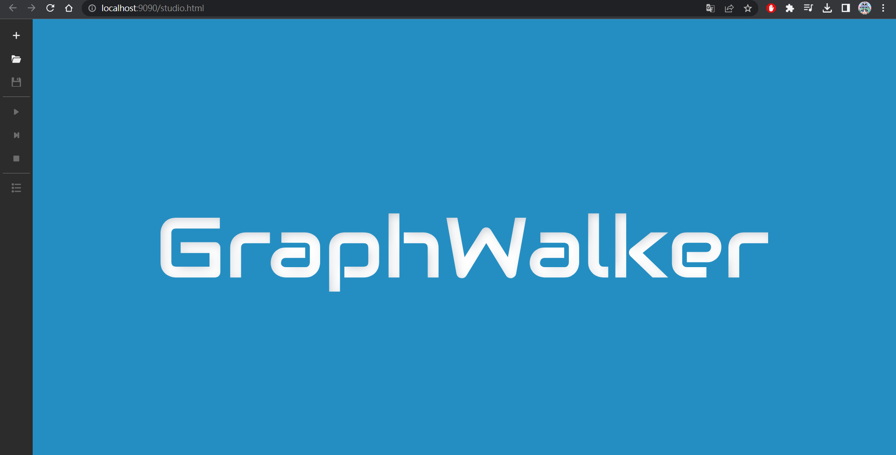
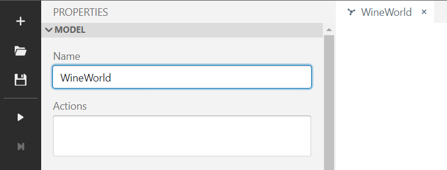
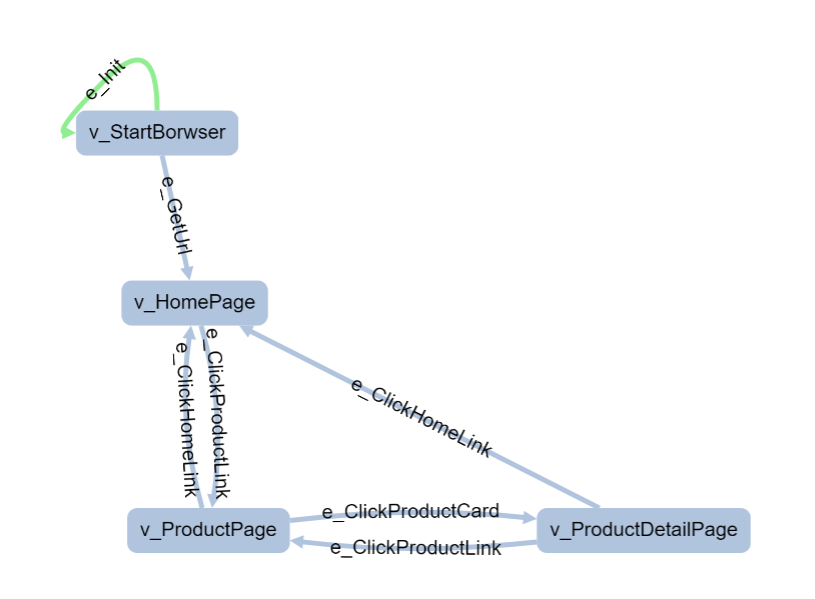
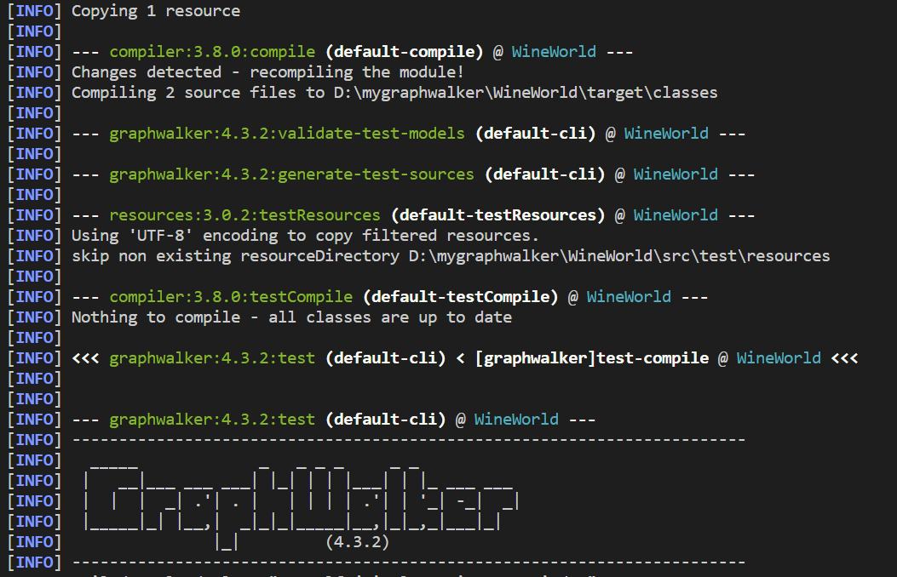
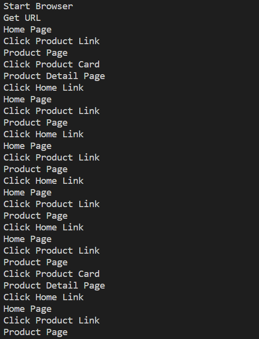
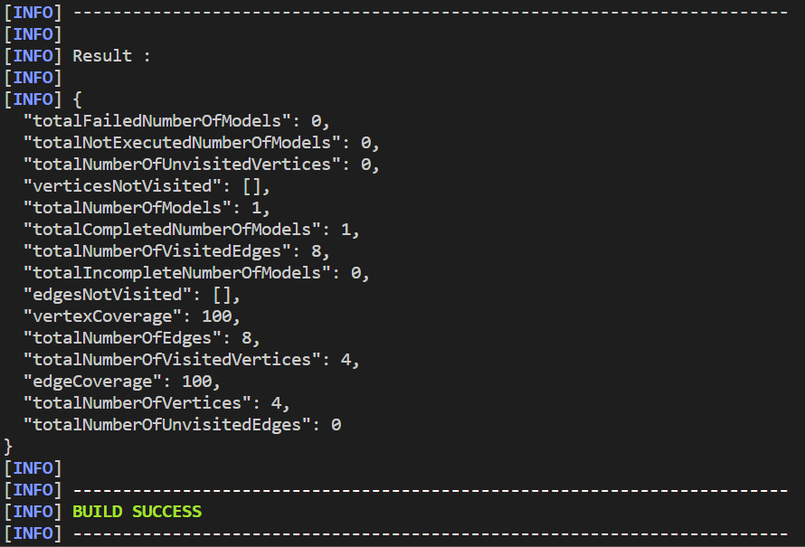

title: 'Graphwalker:  A Simple Example with Selenium'
author: int
tags:
  - test
  - graphwalker
  - selenium
categories: []
date: 2023-03-13 15:48:00
---
這篇文章會用一個簡單的範例來說明 Graphwalker 的使用方法，並且會用到 Selenium 來驅動瀏覽器。

## 關於 Graphwalker
[Graph Walker](https://graphwalker.github.io/) 是一個 [Model Base Testing](https://www.browserstack.com/guide/how-model-based-testing-help-test-automation) 的工具，它可以讓你用一個 Graph 的方式來描述你的測試案例，他提供一個 UI 介面讓你繪製 Model (以 Graph 的方式呈現)，並且可以讓你用 Java 或是 C# 來撰寫測試程式。

## 範例
本篇將會介紹一個簡單的範例以及我痛苦的踩雷歷程來帶大家入門 Graph Walker，程式碼在我的 [GitHub](https://github.com/huanginch/graphwalker-SimpleExapmle) 上可以找到。

### 環境
* Windows 10
* Java JDK 19.0.2 (依照官網說法Java 8 以上都可以)
* Maven 3.9.0
* Graphwalker 4.3.0
* Selenium 4.8.0
關於 [Java](https://www.kjnotes.com/devtools/35) 和 [Maven](https://ithelp.ithome.com.tw/articles/10260305) 的安裝可以參考我提供的連結，這邊就不再贅述。

### Graphwalker 的安裝
Graphwalker 有兩個工具，一個是 [Graphwalker Studio](https://github.com/GraphWalker/graphwalker-project/releases/download/4.3.2/graphwalker-studio-4.3.2.jar)，一個是 [Graphwalker CLI](https://github.com/GraphWalker/graphwalker-project/releases/download/4.3.2/graphwalker-cli-4.3.2.jar)，要建模型的話這邊我們只會用到 Studio，所以我們就先安裝 Graphwalker Studio，後面會用到 Graphwalker CLI 的時候再來安裝。

按連結下載後，把它放到你想要的地方，接著打開命令提示字元，輸入以下指令來執行 Graphwalker Studio。

```bash
java -jar graphwalker-studio-4.3.2.jar
```
或是直接對他點兩下也可以。

之後打開瀏覽器，輸入 [`http://localhost:9090/studio.html`](http://localhost:9090/studio.html)，就可以看到 Graphwalker Studio 的畫面了。



### 建立 Model
這邊 Graph Walker的官網文件就寫得蠻清楚的，可以直接參考他[首頁的 gif](https://graphwalker.github.io/) 建立新的 Model 檔案。

新建好空檔案後記得要改名稱。



模型有兩個元素
* v: Vertex，代表一個狀態或是頁面，是靜態的
* e: Edge，代表一個動作或事件，是動態的

在 Graphwalker Studio 中
* 按住鍵盤的 v 並點擊畫面，可以建立一個 Vertex
* 按住鍵盤的 e 並點擊起點 Vertex 後按住不放，拖曳到目標 Vertex，可以建立一個 Edge

>除了使用 Graphwalker Studio 來建立模型，你也可以使用其他工具來建立，例如 [yEd](https://www.yworks.com/products/yed)，他產出的 graphml 檔案也可以直接拿來使用。

### 我的模型
我的模型是用來測試我自己之前的 Side Project，是一個電商網站。我想要測試從首頁一路點擊到商品細節頁面的流程，所以我建立了以下的模型。



* e_init: 模型的起點，在左側設定欄下方 Start Element 可以打開這個設定
* v\_StartBrowser: 啟動瀏覽器
* e_GetUrl: 進入首頁
* v\_HomePage: 首頁
* e\_ClickProductLink: 點擊商品列表連結
* e\_ClickHomeLink: 點擊首頁連結
* v\_ProductPage: 商品頁面
* e\_ClickProductCard: 點擊商品卡片
* v\_ProductDetailPage: 商品細節頁面

完成後按左方的儲存按鈕，就可以把這個模型儲存下來了。它會自動幫你下載一個叫做 `test.json` 的檔案，記得重新命名成你想要的名稱，這邊我就叫做 `WineWorld.json`， 之後你的 JAVA Interface 會用這個命名。

### 寫測試程式
首先我們要建立一個 Maven 專案，並且加入 Graphwalker 的 Dependency，這邊官方文件就寫的很不清不楚了，好多該加的都沒寫。

1. 建立 Maven 專案
```bash
mvn archetype:generate
```

>這邊官網本來有給一串指令，意思是說可以直接建立一個包含 graphwalker 的 Maven 專案，但是我試了好幾次都失敗，所以我就直接用上面的指令建立一個空的專案，再加入 graphwalker 的 dependency。

設定
GroupId: `tw.inthuang` 這個可以自己設定
ArtifactId: `WineWorld` 這個也可以自己設定
Version: `4.3.2` 這個請不要動，會影響到後面的 graphwalker 的版本
Package: `WineWorld` 這個也可以自己設定

2. 在 `pom.xml` 加入 Graphwalker 的 Dependency

```xml
<dependency>
    <groupId>org.graphwalker</groupId>
    <artifactId>graphwalker-cli</artifactId>
    <version>${project_version}</version>
</dependency>
```
```xml
<dependency>
    <groupId>org.graphwalker</groupId>
    <artifactId>graphwalker-java</artifactId>
    <version>${project_version}</version>
</dependency>
```

3. **重要** 在 `pom.xml` 加入 Maven-graphwalker-plugin 的 Plugin

```xml
<plugin>
    <groupId>org.graphwalker</groupId>
    <artifactId>maven-graphwalker-plugin</artifactId>
    <version>${project_version}</version>
    <executions>
        <execution>
            <id>generate-sources</id>
            <phase>generate-sources</phase>
            <goals>
                <goal>generate-sources</goal>
            </goals>
        </execution>
    </executions>
</plugin>
```

>上面你可以看到不管是 Graphwalker 的 Dependency 還是 Maven-graphwalker-plugin 的 Plugin，都有一個 `${project_version}`，這個是我們在第一步驟設定的 Graphwalker 的版本號，如果你的版本號不是 4.3.2，請記得要改成你的版本號。

4. 加入 Selenium 的 Dependency

```xml
<dependency>
    <groupId>org.seleniumhq.selenium</groupId>
    <artifactId>selenium-java</artifactId>
    <version>4.8.0</version>
</dependency>
```

5. 把 Graphwalker 的 Model 檔案放到 `src/main/resources/tw/inthuang/` 資料夾下
注意，resources 資料夾和 java 資料夾是平行的，不要放錯了，裡面還要包含 GroupId 的資料夾，你的 java 資料夾裡面有幾個資料夾才到自動生成的 App.java，這裡就要有幾個。

```
src|-main-java-tw-inthuang-App.java
   |
   |-main-resources-tw-inthuang-WineWorld.json
```

6. 建立 Graphwalker 的 Interface
使用 graphwalker:generate-sources 這個指令，會自動幫你建立 Graphwalker 的 Interface，這個 Interface 會自動幫你實作 Model 的所有 Vertex 和 Edge。

```bash
mvn graphwalker:generate-sources
```
完成後你會看到多出一個 `target` 資料夾，裡面有很多東西，按照 targert -> generated-sources -> graphwalker -> tw -> inthuang -> WineWorld.java 這個路徑，就可以找到一個名為 WineWorld.java 的檔案 (這個檔案的名稱取決於你的 model file 名稱)。不要客氣點開來看看會發現有許多用你剛剛模型的 Vertex 和 Edge 命名的 Method，這些 Method 就是 Graphwalker 會自動幫你實作的。

7. 實作 Test.java
打開你的 `main` 資料夾，最裡面應該有一個預設的 App.java，把它刪掉，然後建立一個名為 WineWorldTest.java 的檔案，裡面寫入以下程式碼。

```java 
package WineWorld;

import java.time.Duration;

import org.graphwalker.core.machine.ExecutionContext;
import org.graphwalker.java.annotation.AfterExecution;
import org.graphwalker.java.annotation.BeforeExecution;
import org.graphwalker.java.annotation.GraphWalker;
import org.openqa.selenium.By;
import org.openqa.selenium.Keys;
import org.openqa.selenium.support.ui.ExpectedConditions;
import org.openqa.selenium.support.ui.WebDriverWait;
import org.openqa.selenium.firefox.FirefoxDriver;
import org.openqa.selenium.WebDriver;
import org.junit.Assert;

/**
 * Hello world!
 *
 */
@GraphWalker()
public class WineWorldTest extends ExecutionContext implements WineWorld {

    public static FirefoxDriver driver = new FirefoxDriver();
    WebDriverWait wait = new WebDriverWait(driver, Duration.ofSeconds(10));

    @BeforeExecution
    public void setup() {
        System.out.println("Setup happens here");
    }

    @AfterExecution
    public void cleanup() {
        System.out.println("Cleanup happens here");
        driver.quit();
    }

    public void e_Init() {
        System.out.println("Init");
    };

    public void e_ClickHomeLink() {
        System.out.println("Click Home Link");
        wait.until(ExpectedConditions.visibilityOfElementLocated(By.partialLinkText("WineWorld")));
        wait.until(ExpectedConditions.invisibilityOfElementLocated(By.className("loading")));
        driver.findElement(By.partialLinkText("WineWorld")).click();
    };

    public void e_ClickProductLink() {
        System.out.println("Click Product Link");
        wait.until(ExpectedConditions.visibilityOfElementLocated(By.linkText("商品列表")));
        driver.findElement(By.linkText("商品列表")).click();
    };

    public void e_ClickProductCard() {
        System.out.println("Click Product Card");
        wait.until(ExpectedConditions.visibilityOfElementLocated(By.className("card")));
        wait.until(ExpectedConditions.invisibilityOfElementLocated(By.className("loading")));
        driver.findElement(By.className("img-overlay")).click();
    };

    public void e_GetUrl() {
        System.out.println("Get URL");
        driver.get("https://inthuang.tw/WineWorld/");
    };

    public void v_StartBorwser() {
        System.out.println("Start Browser");
    };

    public void v_HomePage() {
        System.out.println("Home Page");
        wait.until(ExpectedConditions.titleContains("Wine World | 你要找的酒，都在這裡"));
        Assert.assertEquals("Wine World | 你要找的酒，都在這裡", driver.getTitle());
    };

    public void v_ProductPage() {
        System.out.println("Product Page");
        wait.until(ExpectedConditions.urlContains("#/product"));
        Assert.assertEquals("product", driver.getCurrentUrl().substring(32));
    };

    public void v_ProductDetailPage() {
        System.out.println("Product Detail Page");
        wait.until(ExpectedConditions.visibilityOfElementLocated(By.tagName("h3")));
        Assert.assertEquals("商品介紹", driver.findElement(By.tagName("h3")).getText());
    };

    public void e_NewEdge() {
        System.out.println("New Edge");
    };
}
```
[Source](https://github.com/huanginch/graphwalker-SimpleExapmle/blob/master/WineWorld/src/main/java/WineWorld/WineWorldTest.java)

總之就是實現剛剛 Graphwalker 產生的 Interface，然後實作裡面的 Method。

簡單介紹一下大致在做什麼:
```java
public static FirefoxDriver driver = new FirefoxDriver();
WebDriverWait wait = new WebDriverWait(driver, Duration.ofSeconds(10));
```
設定瀏覽器和等待時間

```java
@BeforeExecution
public void setup() {
    System.out.println("Setup happens here");
}

@AfterExecution
public void cleanup() {
    System.out.println("Cleanup happens here");
    driver.quit();
}
```
設定測試開始前和結束後的動作，這邊我們只是印出一些訊息，然後關閉瀏覽器。

```java
public void e_Init() {
    System.out.println("Init");
};
```
這個 Method 就是 Graphwalker 產生的 Interface 裡面的 `e_Init`，這個 Method 就是在測試開始前會執行的動作，我們只是印出一些提示訊息。

```java
public void e_ClickHomeLink() {
    System.out.println("Click Home Link");
    wait.until(ExpectedConditions.visibilityOfElementLocated(By.partialLinkText("WineWorld")));
    wait.until(ExpectedConditions.invisibilityOfElementLocated(By.className("loading")));
    driver.findElement(By.partialLinkText("WineWorld")).click();
};
```
等待網頁上的 `WineWorld` 這個 Link 出現，然後點擊它，不過因為我有些頁面有蓋一個 loading 的 overlay，所以又多一行等待他消失的程式。

```java
public void e_ClickProductLink() {
    System.out.println("Click Product Link");
    wait.until(ExpectedConditions.visibilityOfElementLocated(By.linkText("商品列表")));
    driver.findElement(By.linkText("商品列表")).click();
};
```
等待網頁上的 `商品列表` 這個 Link 出現，然後點擊它。

```java
public void e_ClickProductCard() {
    System.out.println("Click Product Card");
    wait.until(ExpectedConditions.visibilityOfElementLocated(By.className("card")));
    wait.until(ExpectedConditions.invisibilityOfElementLocated(By.className("loading")));
    driver.findElement(By.className("img-overlay")).click();
};
```
等待網頁上的 `card` 這個 Class 出現，然後點擊它，同樣也是因為 overlay 的原因，我們又多一行等待他消失的程式。

```java
public void e_GetUrl() {
    System.out.println("Get URL");
    driver.get("https://inthuang.tw/WineWorld/");
};
```
對網址 `https://inthuang.tw/WineWorld/` 發出 get 請求。

```java
public void v_StartBorwser() {
    System.out.println("Start Browser");
};
```
啟動瀏覽器。

```java
public void v_HomePage() {
    System.out.println("Home Page");
    wait.until(ExpectedConditions.titleContains("Wine World | 你要找的酒，都在這裡"));
    Assert.assertEquals("Wine World | 你要找的酒，都在這裡", driver.getTitle());
};
```
等待網頁的 title 包含 `Wine World | 你要找的酒，都在這裡`，然後驗證網頁的 title 是否等於 `Wine World | 你要找的酒，都在這裡`。

```java
public void v_ProductPage() {
    System.out.println("Product Page");
    wait.until(ExpectedConditions.urlContains("#/product"));
    Assert.assertEquals("product", driver.getCurrentUrl().substring(32));
};
```
等待網頁的 url 包含 `#/product`，然後驗證網頁的 url 是否等於 `#/product`。

```java
public void v_ProductDetailPage() {
    System.out.println("Product Detail Page");
    wait.until(ExpectedConditions.visibilityOfElementLocated(By.tagName("h3")));
    Assert.assertEquals("商品介紹", driver.findElement(By.tagName("h3")).getText());
};
```
等待網頁上的 `h3` 這個 Tag 出現，然後驗證網頁上的 `h3` 這個 Tag 的文字是否等於 `商品介紹`。

```java
public void e_NewEdge() {
    System.out.println("New Edge");
};
```
這個東西其實我不知道是哪來的，但是 Graphwalker 產生的 Interface 裡面有這個東西，所以我也不得不實作它，猜測可能是當初建立的模型有多按到一條 Edge 導致的，但我沒看到他在哪，真尷尬，總之你的模型要是沒問題就別管他。

## 執行測試
接下來就是執行測試了，我們只要在終端機輸入以下指令就可以了:
```bash
mvn clean graphwalker:test
```
clean 是清除之前的編譯結果，graphwalker:test 是執行 Graphwalker 的測試。

執行完後，就會看到噴出一堆運行結果，可以看到 graphwalker 的 logo 出現在畫面上，還記得當初看到有多感動，試了好多次才看見他。



然後就是一些測試過程中會印出的訊息



最後會看到執行結果以及 Build Success



大功告成!

## Debug
這邊教你怎麼看測試後的報告，執行 `mvn clean graphwalker:test` 後，會在專案的根目錄下產生一個 `target` 的資料夾，裡面會有一個 `graphwalker-reports` 的資料夾，資料夾裡有一個名字很長的 xml，這就是我們要的報告，打開後拉到最底下會看見錯誤訊息以及錯誤的行數。

## 結論
這篇文章分享了這兩天踩雷的結果，畢竟官方的文檔給了好多方法但是前後說詞不一阿... 像是根本沒提到 model 可以是 json 也可以是 graphml，又或者是沒說要加入 graphwalker 的 plugin，這些都是我花了很多時間才找到的，希望這篇文章能幫助到大家，如果有任何問題歡迎敲我 DC 或 推特討論。