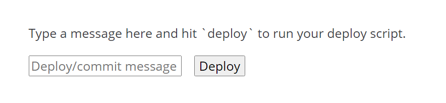

title: 使用Hexo admin來部屬(deploy)網站
author: int
tags:
  - hexo
categories:
  - hexo introduce
date: 2022-05-21 11:33:00
---
Hexo admin是一個很方便的插件，可以用圖形化介面來管理你的網站後台，不過下載後來是要自己設定一些東西才能部屬網站，這篇文就是來介紹部屬的設定。

## 步驟
1. 安裝hexo admin: 在cmd輸入以下指令，不知道怎麼打開cmd可以看[這篇文](https://huanginch.github.io/2022/05/19/My-First-Post/)
```
$npm install hexo-admin --save
```
2. 打開blog資料夾裡的 **_config.yml**，在最底下新增以下程式碼
```
admin:
          deployCommand: 'hexo-publish.bat'
```
3. 在跟 **_config.yml** 同一層的地方新增一個叫 **hexo-publish.bat** 的檔案

4. 在**hexo-publish.bat**中新增以下程式碼
```
hexo g -d
```
5. 切換到Hexo Admin中的deploy頁面


6. 在輸入欄輸入本次更新說明文字後按下deploy即可


因為我自己是用github.io來部屬網站，所以我成功後就可以在自己的github上面看到更新後的檔案，至於怎麼使用github來部屬網站可以到[這篇文](https://huanginch.github.io/2022/05/22/deploy-on-github/)。