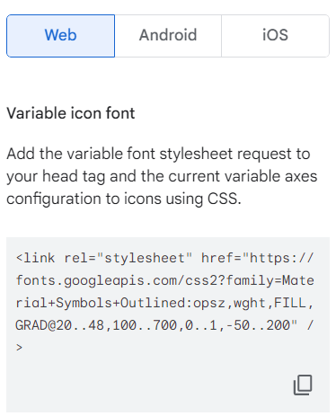
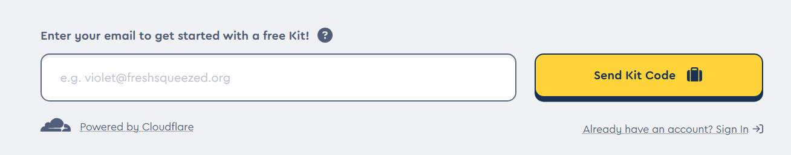
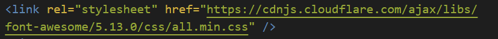
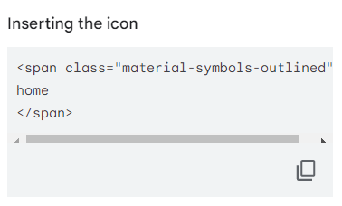

title: 如何在網頁上使用線上icon
author: int
tags:
  - html
  - css
categories: []
date: 2022-09-03 14:52:00
---
在網頁上通常會使用小圖示或icon來增加設計感與樣式，也有許多按鈕都是使用icon來呈現，這篇會介紹線上svg或線上icon的引入方式。

1. 線上icon網站
	* 首先要找到有提供線上icon的網站，常用的有[google font](https://fonts.google.com/icons)、[fontawsome](https://fontawesome.com/)等免費網站(fontawsome為部分收費)。
2. 根據icon網站的指引引入cdn
	* 以google font為例，點擊icon後右手邊就會出現cdn可以讓開發者引入
	

	* fontawsome的話要先填寫email他才會寄cdn給你
    
	
3. 將cdn引入專案中
	* 把複製好的code貼到自己html的header即可
    
	
4. 根據網站的說明複製對應的icon code
	* 引入cdn後就可以開始使用icon了，以google font為例，右手邊也會有icon自己的code，只需要複製並貼到自己想要放icon的位置即可
    
	