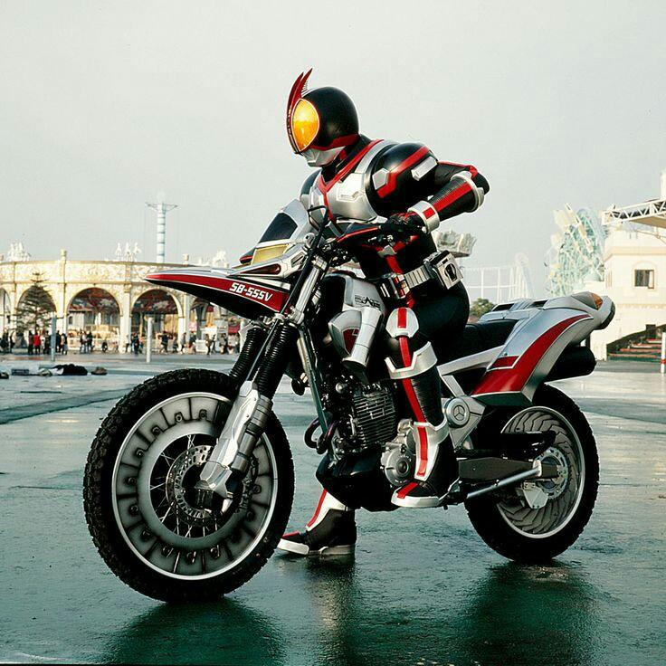

title: 常見html標籤
author: int
tags:
  - html
categories: []
date: 2022-06-27 11:43:00
---
html，全名為HyperText Markup Language，其中會用到很多標籤來做撰寫，這篇會簡單介紹一些常用標籤。

## h1~h6
這些是標題標籤，其中h1為主標題，其他就是副標題，重要性依序遞減，因為h1是主標題所以只能出現一次，出現超過一次的用法都是錯的，寫法如下:

```html
<h1>標題</h1>
<h2>副標題</h2>
```
結果:

<h1>標題</h1>
<h2>副標題</h2>

## p
p標籤代表段落，就當作是寫文章會有標題就會有內文，p就是讓你用來表示一段話的

```
<p>這是一段話這是一段話這是一段話這是一段話</p>
```
結果:

<p>這是一段話這是一段話這是一段話這是一段話</p>


## a
a標籤是用來設定外部連結，他有一個屬性叫href，可以在裡面放置網址，網頁就會出現外部連結可以點擊，寫法如下:
```html
<a href="https://www.google.com">link</a>
```
結果:

<a href="https://www.google.com">link</a>

點擊link就會連到google首頁

## img
img就是image的縮寫，也就是用來放圖片的，通常會有兩個屬性，一個是src，用來放圖片連結，另一個是alt，用來放文字說明

```html

```
結果:



## div
div可以比較特別，他可以在網頁上劃出一個區塊，像個盒子一樣，基本上是為了方便css做撰寫

```html
<div>div1</div>
<div>div2</div>
```

結果:
<div>div1</div>
<div>div2</div>

## input
input會產生一個輸入欄位，可以讓使用者輸入文字，屬性type通常會設置為text

```html
<input type="text"/>
```
結果:
<input type="text"/>
<br/>
## button
button就是按鈕，在網頁上產生一個可以讓使用者互動的按鈕
```html
<button>按我</button>
```
結果:
<button>按我</button>
<br>

## ul、ol、li
ul是unordered list，而ol是指order list，li指的是list item，所以寫法是會把li包在ul或ol裡面。
```html
<ul>
  <li>item1</li>
  <li>item2</li>
</ul>

<ol>
  <li>item1</li>
  <li>item2</li>
</ol>
```
結果:
<ul>
  <li>item1</li>
  <li>item2</li>
</ul>

<ol>
  <li>item1</li>
  <li>item2</li>
</ol>

## br、hr
br代表換行，hr代表分隔線

```html
<p>abc</p>
<br/>
<p>def</p>
<hr/>
```
結果:

<p>abc</p>
<br/>
<p>def</p>
<hr/>

## 註解標籤

跟其他程式語言一樣，html也有註解可以使用
```html
<!--這是註解-->

<p>這是一段話</p>
```
結果:

<!--這是註解-->

<p>這是一段話</p>

可以看到只有p段落有顯示出來


常用標籤就差不多介紹到這邊，當然還有很多很多標籤沒有介紹到，這邊只是列出很常見的，之後有機會再介紹其他標籤。