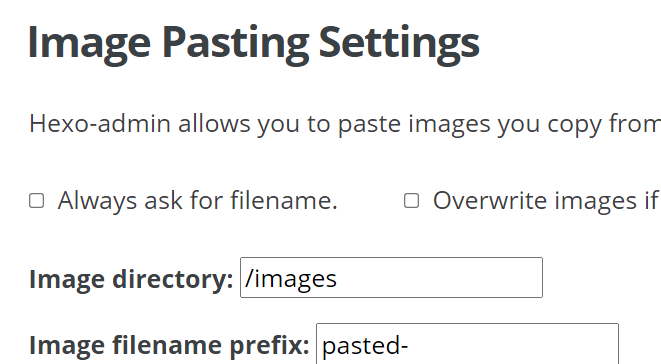

title: 在HEXO文章上插入本地端圖片
author: int
tags:
  - hexo
categories:
  - hexo introduce
date: 2022-05-20 18:24:00
---
<p>圖片對文章來說是很重要的，有了圖片的文章在各方面都比較好閱讀，想當然如果能直接上傳電腦中的圖片到文章上會是件很方便的事，然而用預設編輯器打開文章可能沒辦法直接上傳本地端的圖片，所以這篇文就要來介紹如何在你的HEXO文章中插入本地端圖片。</p>

## 步驟
1. 先去下載hexo admin插件，在cmd輸入以下指令就可以了，不知道怎麼開cmd可以看我[上一篇文](https://huanginch.github.io/2022/05/19/My-First-Post/)
```
$npm install hexo-admin --save
```
2. 下載好以後打開你的hexo server，打開瀏覽器輸入網址**http://localhost:4000/admin** 就可以進入hexo後端主控台

3. 其實到這邊就差不多結束了，只要用admin編輯文章就能直接貼上圖片

## 使用說明
現在你可以貼上任何來源的圖片，包含你電腦本地端的圖片，使用複製貼上hexo就會自動幫你上傳圖片，上傳完成後會出現以下Markdown語法:
```Markdown

```
之後你需要把這個語法改成顯示圖片的Markdown語法如下所示:
```

```
其中括弧內代表圖片的位址，同時pasted-0.png代表圖片名稱，是hexo自己取的，你也可以到admin settings更改設定，這個等等再介紹。
<br/>
改好後圖片就可以成功顯示了，如果忘記圖片路徑可以到D:/blog/source/images查看(我的電腦是把hexo裝在D槽，所以根目錄才是D:，要看你當初裝在哪)

## 更改設定
可以到admin的setting更改上傳圖片後會存的資料夾名稱與圖片前綴


最底下的Image Pasting Settings可以調整這兩個設定



Image diectory可以更改資料夾名稱<br/>
Image filename prefix可以更改圖片前綴，前綴就是你圖片名稱最前面的**pasted-**

## 總結
當初原本按照[這篇文章](https://yeweimian21.github.io/2019/05/23/Hexo/Hexo-insert-image/)來做，結果他還是顯示不出來，後來參考了[這篇文章](https://ed521.github.io/2019/08/hexo-admin/)才順利解決，沒想到上傳個圖片會比我想的還費工夫XD 不過至少能用了，分享給大家。