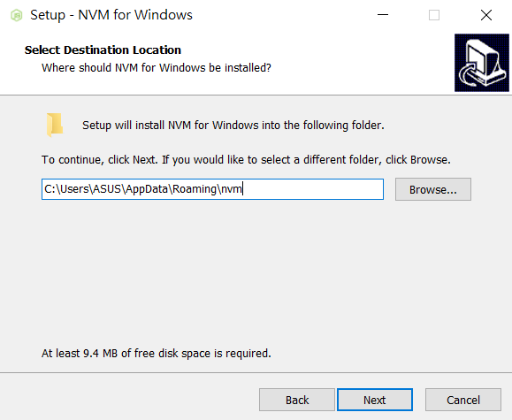
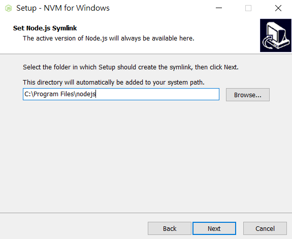
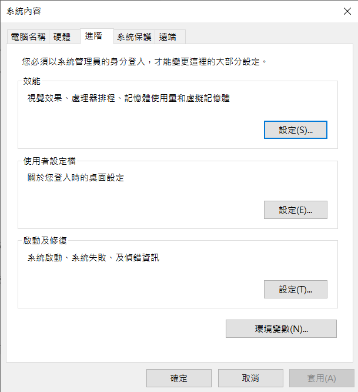
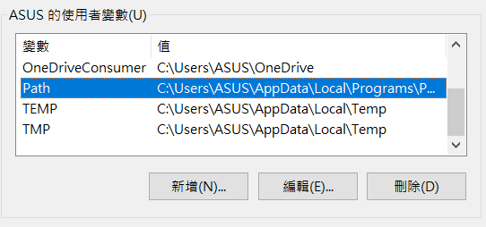
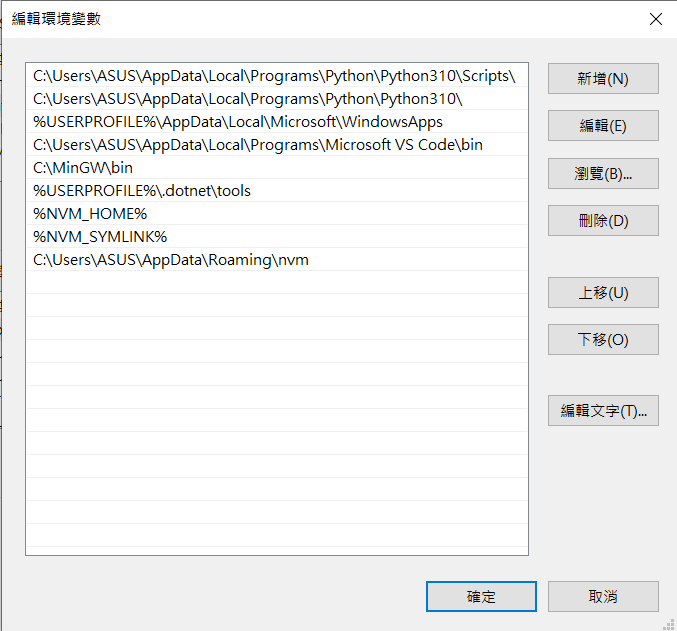

title: 'Nodejs: 更改版本'
author: int
tags:
  - nodejs
  - nvm
  - hexo
categories: []
date: 2022-06-18 12:34:00
---
昨天在做六角的作業時有項任務是要架設GGG環境(用gulp建立github page)，但是我的node是最新版本(v16)，而gulp要求的版本只能在v12~v14(其實我不確定是不是gulp，因為當初報錯是node-sass找不到)，反正結論就是要用v14，我就想說找個可以隨意切換版本的，因為刪掉重裝好像有點硬A，所以我就找到nvm這個東西。殊不知，問題一堆，安裝環境這東西真的是搞死我。


先一步一步來說好了，一開始我是先按照六角給的指示安裝了一個node.exe(v14)，可是我電腦的環境沒辦法被這東西蓋掉，我裡面的v16還是活得好好的，所以我就跑去裝nvm，參考了蠻多篇，我也不知道為什麼大家都寫的這麼不清楚，所以我這邊會好好解釋。

## nvm安裝步驟

1. 去[官網](https://github.com/coreybutler/nvm-windows/releases)下載nvm-setup.exe，你要載zip也行，裡面打開也就一個一樣的exe。

2. 載完之後執行他，按下一步之後停下，把這個路徑記起來。

	
    
    再下一步是nodejs路徑

	

	這裡請把nodejs資料夾移到一個名字沒有空格的路徑底下。
    
    完成後去修改環境變數，把剛剛複製的路徑貼上。步驟如下:
    
    1. 打開設定->系統->關於->右手邊的進階系統設定
    2. 打開後會出現一個視窗，按下那個環境變數
    
	

	3. 找到上面那格的path按下編輯
    
	
    
    4. 按下新增，貼上路徑，儲存確定離開
    
	
    
    5. 到終端機打
    ```
    curl -o- https://raw.githubusercontent.com/nvm-sh/nvm/v0.39.1/install.sh 
    ```
    
    [註]本人環境為windows，mac我不會XD
    
    <br/>
   
我之前就是少做了新增環境變數所以一直沒辦法執行nvm，我也不知道為什麼其他說明都沒寫到要修改，可能是我上面那兩個他自己幫我加的nvm路徑沒作用吧，具體原因我也不知道為什麼。
    
再來就是下載node v14，我一開始以為我用的方法是對的，結果今天要來hexo寫文發現v14不支援hexo，想改回v16卻發現沒用。恩? 這當初不就是要來切換版本的嗎怎麼沒有用??

那是因為我一開始不管怎麼用六角給的node.exe他就是沒辦法切換(可能我放錯路徑，但我現在還是不知道該放哪)，所以我就跑去載了msi檔，因為當初裝v16也是載這個，欸，等等，其實這樣會把原本的v16蓋掉，說好的用nvm不要硬A呢? 但是我真的沒注意到這件事，看到nvm列出版本有v14，正在使用的也是v14，GGG也用好了就以為萬事ok了(而且那時候我打錯nvm install指令所以一直載不好才用msi檔。)

所以該怎麼辦?

## nvm 切換版本步驟

1. 把電腦中的node環境全部remove掉

2. 對cmd按右鍵，以系統管理員身分執行cmd

3. nvm install [版本名稱]
	```
    nvm install 16.14.0
    ```
    * 想看有沒有裝成功可以使用nvm list觀看，他會列出所有已安裝的版本。

4. nvm use [版本名稱]
	```
    nvm use 16.14.0
    ```
    * 如此一來就可以自由切換node版本了
    
真的沒想到建個環境會遇到這麼多問題，而且我本來以為我解決了，沒想到又跑出一堆問題，今天執行hexo發現不能用真的嚇了我一跳，然後要切版本又切不回去QQ，搞了半天根本是昨天就搞錯了，用nvm就直接用nvm裝node就好，不要另外裝node.exe還是什麼的，不過剛好可以當作一篇文章記錄起來XD 希望我沒有漏掉什麼，如果有哪裡看不懂歡迎再跟我說。

