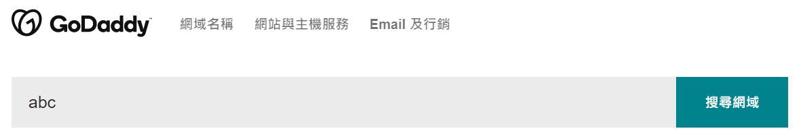
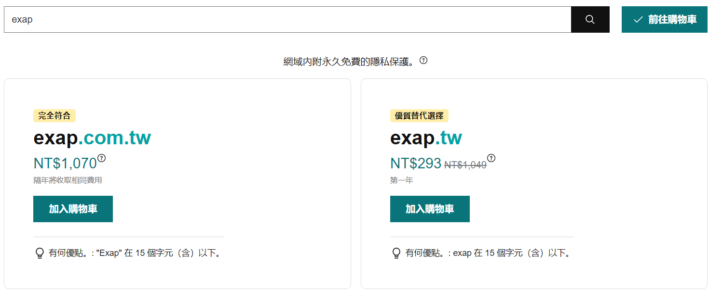
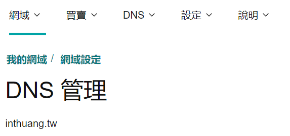
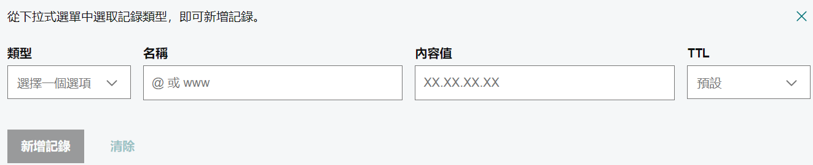
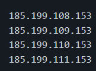
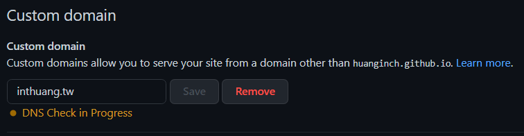
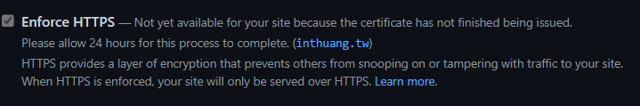
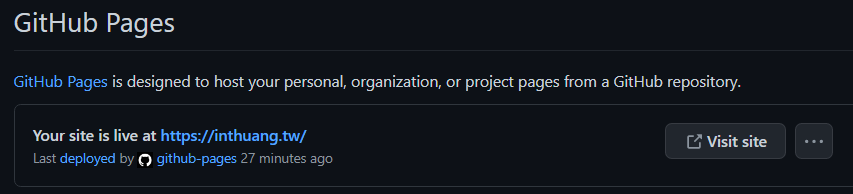

title: 'Github pages 設定 domain name: 以部屬在github pages上的HEXO為例'
author: int
tags:
  - domain name
  - DNS
  - github pages
  - hexo
categories: []
date: 2022-09-22 12:52:00
---
最近在[godaddy](https://tw.godaddy.com/)上購買了一個網域名稱，經過幾番波折終於幫自己的github page設定好自訂的domain name了，這篇會來介紹怎麼設定。

## 購買網域名稱
第一步當然是要去買一個網域，除了godaddy也有其他服務可以用，這邊就只介紹godaddy，基本上大同小異。

* 輸入自己想要的網域名稱看看有沒有被使用，沒有就可以繼續

* 我這裡就隨便打幾個字，他會給你推薦方案，我自己是買了inthuang.tw這個名稱

## godaddy設定
* 進到設定裡面，找到自己購買的網域

* 點選新增

* 輸入以下網域
	1. 自己的github.io的網址
  
  
	2. github主機ip
    	
	
    
    	* github總共提供四個ip，我是任選兩個設定
    
	
    
## github page設定

* 到自己hexo的repo設定裡，如果不知道怎麼部屬hexo到自己的git上面可以參考[這篇](https://inthuang.tw/2022/05/22/deploy-on-github/)

* 在設定裡找到pages

* 往下拉有個custom domain，輸入你購買的網域名稱

* 等他跑好就行，記得跑好後要勾選下面的啟用https

* 拉到最上面就可以看到自己網頁的link成功變成自訂的domain name

## 結語
網路上很多教學都有點舊，不知道是不是因為git改版過還是怎樣，在設定DNS指向github.io時，所有我找到的教學網站都叫我在name輸入www，內容值輸入username.github.io，害我卡半天，改成name輸入username，內容值輸入github.io就成功了。

如此一來其他的專案的domain name也能變成我自訂的名稱，不用特別設定，因為他們都是在github.io底下的網站，相當方便。