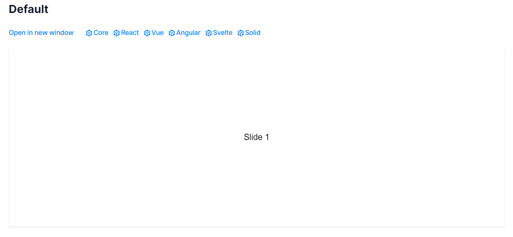

title: '輪播插件: swiper.js'
author: int
tags:
  - js
  - css
categories: []
date: 2022-09-05 00:33:00
---
這篇要介紹一個很好用的插件-swiper.js。這個插件可以用來做卡片輪播動畫，最重要的是他提供RWD以及可以客製化樣式。

## 安裝

* 官網: https://swiperjs.com/
* npm: 
	```bash
    npm install swiper
    ```
* CDN:
	```html
    <link
      rel="stylesheet"
      href="https://cdn.jsdelivr.net/npm/swiper@8/swiper-bundle.min.css"/>

    <script src="https://cdn.jsdelivr.net/npm/swiper@8/swiper-bundle.min.js"></script>
    ```
## 使用方法
 1. html
 	* 最外層是swiper，內層會有swiper-wrapper，wrapper裡面用swiper-slide包輪播的卡片。視需求可以新增pagination(底下的換頁點點)、navigation buttons(左右換頁)、scrollbar
 
	```html
		<!-- 這裡的mySwiper可以自己取 -->
		<div class="swiper mySwiper">
          <!-- Additional required wrapper -->
          <div class="swiper-wrapper">
            <!-- Slides -->
            <div class="swiper-slide">Slide 1</div>
            <div class="swiper-slide">Slide 2</div>
            <div class="swiper-slide">Slide 3</div>
            ...
          </div>
          <!-- If we need pagination -->
          <div class="swiper-pagination"></div>

          <!-- If we need navigation buttons -->
          <div class="swiper-button-prev"></div>
          <div class="swiper-button-next"></div>

          <!-- If we need scrollbar -->
          <div class="swiper-scrollbar"></div>
       </div>
	```
  2. css
 	* swiper有提供自己的css，可以按照css內定義的class，用覆蓋的方式複寫上自己的樣式，有些東西有swiper自己的樣式，在修改時要特別注意。更多可以參考[官方文件](https://swiperjs.com/swiper-api#css-styles)
    
 3. js
 
 	* swiper提供非常多js動畫，可以根據自己需求選擇對應的動畫，可以參考[官網的demo](https://swiperjs.com/demos)，點擊open in new window可以觀看原始碼
    
	
    
    * 要使用swiper的初始設定要在js撰寫swiper的語法(.mySwiper要填入自己為swiper命名的class)
    
    ```js
    var swiper = new Swiper(".mySwiper", {});
    ```
	* 要新增其他動畫等等就可以依據官網的各種demo複製貼上做修改 
    
 ## 總結
 
 swiper最強大的但同時也最讓我頭痛的是他的樣式客製化，會寫的話基本上什麼樣的樣式都能靠自己手刻css寫出來，但麻煩的是要先弄清楚他原本的css怎麼寫，否則會蓋不掉。